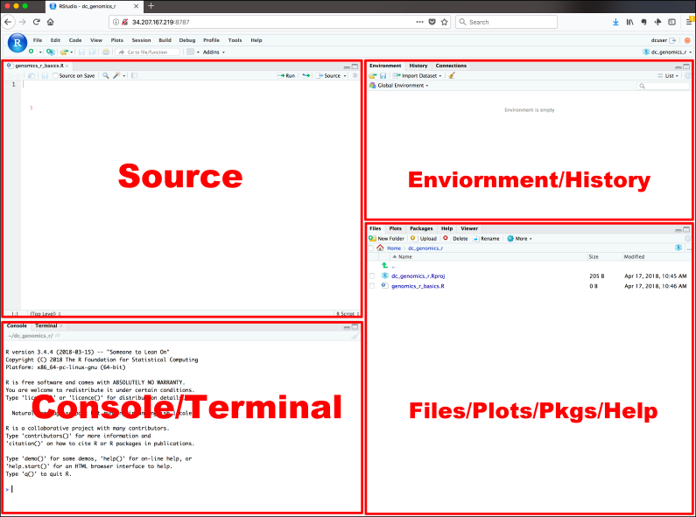
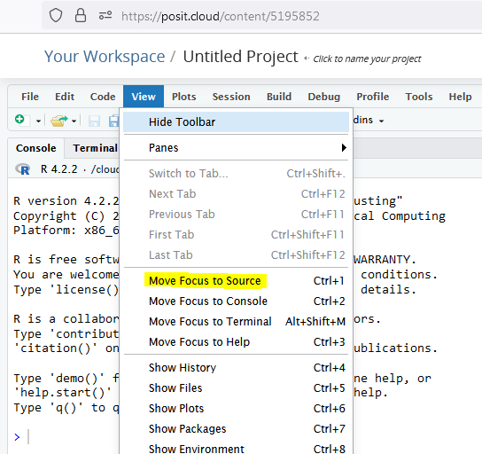
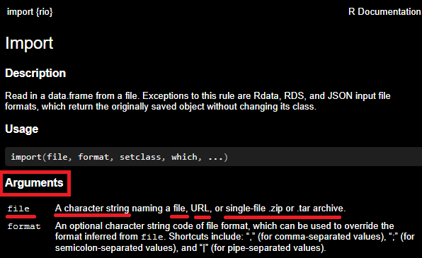
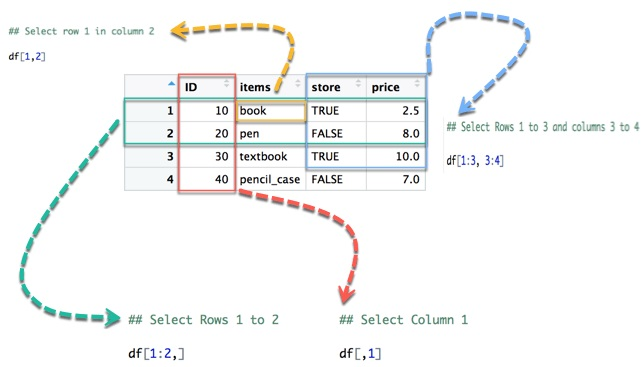

```{r setup, include=FALSE}
library(learnr)
library(tufte)
library(rio)
library(visdat)
library(fs)
library(ggplot2)
library(DiagrammeR)
library(r2symbols)
library(learnr)
library(gradethis)
library(skimr)

gradethis::gradethis_setup()

df <- rio::import("./data/simple_sids_epiinfo2.xlsx")

df_no_dups <- df[!duplicated(df),]


# tutorial_options(
#   exercise.timelimit = 60,
#   # A simple checker function that just returns the message in the check chunk
#   exercise.checker = function(check_code, ...) {
#     list(
#       message = eval(parse(text = check_code, ...)),
#       correct = logical(0),
#       type = "info",
#       location = "append"
#     )
#   }
# )
knitr::opts_chunk$set(error = TRUE)
```

<br></br>
<center>{#id .class width="40%" height="40%"}
</center>

# Introduction

In the [last session](https://sithor.shinyapps.io/Tutorial_2/){target="_blank"}, we discussed some basic concepts related to the use of [`R`](https://cran.r-project.org/){target="_blank"} for statistical computing.

This session, we will focus on continuing to take baby steps with `R` and revise and develop some of the concepts from the last tutorial.

We are going to take a plunge in the grown-up world of statistical computing and coding. This can be nerve wracking, but with a bit of practice, I think you'll find it deeply satisfying, and it will open up many different career opportunities.

We will learn how to:

-   navigate the [`posit`](https://posit.cloud/plans/free){target="_blank"} `r sym("trademark")` interface
-   learn how to write comments in your code using `#`
-   install and load libraries, extending the functionality of `R`
-   import data 
-   understand the types of variables we may have in our data, and
-   check the integrity of our data, focusing on: duplicates, missing data, and ranges.

## Navigating the posit`r sym("trademark")` interface

In this session, we will be practising some coding on the web, but ultimately, we want you to build confidence with using  [Posit](https://posit.co/){target="_blank"},`r sym("trademark")` an 'integrated development environment' or IDE for coding `R`. 

You can download a free version of Posit to run on your Windows`r sym("trademark")` or Mac computer`r sym("trademark")` or as we will do in this course, we will use [Posit cloud](https://posit.cloud/project/3679722){target="_blank"}.`r sym("trademark")` You will need to sign-up for an account, but if you use less than 25 hours per month, it will be free. The terms of the free account are [here](https://posit.cloud/plans/free){target="_blank"}. The benefit of using Posit cloud`r sym("trademark")` is that we don't have to install anything, and sometimes there are problems with permissions that can cause trouble for students starting out. 

Our aim here is keep things as *simple* as possible.

<center>{#id .class width="50%" height="50%"}</center>

Using `R` and `posit` `r sym("trademark")` can be unforgiving. It is **case-sensitive** and if you don't get the `function` and `object` names exactly **right**, `R` will not understand what you are trying to tell it to do. `R`, although very sophisticated, is a super dumb machine! It carries out to the letter exactly what you tell it. Please bear this in mind next time you are troubleshooting with it!

Also, it is useful to litter your code with comments, so that if you forget what your code is doing, you can read your comments to explain what is happening. When you are coding, you have to bear in mind your forgetful future self! These can be done, simply by using a `#` sign in front of what you are writing.

`posit` has four different parts and at first it can be a bit intimidating. Let's explore the different parts of the program before we start.

<center></center>

### What are the four different panes in posit`r sym("trademark")`?

It seems strange, but the `Source` pane sends commands to the `Console`. This is so that you have a record of what you've done as your `Source` file, which is simply plain text. The file extension, which is the type of file you create when working with `R` is a `.R` file. The `Console` is like the brains of the operation and executes your commands from the upper `Source` window. The right upper pane shows the `objects`s or *datasets* or other objects that we are working on and the bottom right pane has different tabs to see our files, plots, packages and help.

#### What if I don't see the `Source` pane?

In `posit`, I suggest to go to the `View` -> `Move Focus to Source` to bring up the source pane if it is not present.

<center>
{#id .class width="50%" height="50%"}
</center>


### Why use code?

Most of us are probably familiar with 'point and click' computer programs that hide a lot of the complexity of computer commands from us. This is what we were using with [iNZight](https://inzight.nz/){target="_blank"} in the `POPLHLTH 216` course. They are generally very good for many things. One of the problems, however, with 'point and click' systems is that they don't easily allow you to see a record of what you have done to share with others (reproducibility), and they make it difficult to redo a series of complex commands that may need to be updated. Data analysis for epidemiology often requires reproducibility and so coding is often necessary.

### Test your understanding...


```{r basics, echo=FALSE}
question("Which of the following windows or panes do we write code into when we use posit?",
  answer("`Source` (top left)", correct = TRUE, message = "Yes, this is the text file that will do its work on various objects, such as a spreadsheet of epidemiological data."),
  answer("`Console` (bottom left)", message = "No, this is where you'll see the output from your `Source` panel."),
  answer("`Environment` (upper right)", message = "No, this is the various objects that are in your workspace."),
  answer("`Files, plots, Packages, Help` pane (bottom right)",  message = "No, this is where we produce plots, or look for files that we can access or see help related to a function we trying to use."),
  allow_retry = TRUE
)
```


Ok, so now we know something about how our interface will work.


## Extending `R` by using libraries

`R` is like a 'go cart' that many, many, many people have contributed to and has been turned into a Rolls-Royce. Basic mathematical and statistical `functions` are 'built-in' to `R`, but libraries are little 'packages' of code with additional `functions` that allow us to extend the use of `R`.

Four libraries will help us achieve our goals today will be:

```{r eval = FALSE}
rio

```

which helps us import a variety of data from a wide variety of formats, such as Excel of comma delimited files (`.csv`). See [here](https://www.rdocumentation.org/packages/rio/versions/0.5.29){target="_blank"} for more information.

```{r eval = FALSE}
visdat
```

This helps us see missing data in our `data.frame` in a visual manner.

```{r eval = FALSE}
skimr
```

`skimr` is a package for summarising our data.frame. See more information [here](https://docs.ropensci.org/skimr/articles/skimr.html){target="_blank"}.

To install libraries, we need to be connected to the **internet**!

To install and load libraries in `R` we use the following code:

```{r eval = FALSE}
install.packages("rio")
library(rio)
```

This is the simple way. If you have already loaded `rio`, then a way to not have to re-install it is with a bit more code that I'll use quite frequently:

```{r eval = FALSE}
if(!require(rio)) install.packages("rio")
library(rio)
```

This is a bit complex, but illustrates a useful function. In computing we can make the computer do stuff if a certain condition is fulfilled or is `TRUE`. This is called *conditional logic*. It is vitally important.

The

```{r eval = FALSE}
if(!require(rio)) 
```

bit, is saying "*have a look and see whether you already have the `rio` package*". The

```{r eval = FALSE}
require(rio) 
```

bit will return a logical value of `TRUE` if it is already loaded in your computer, and `FALSE` if not. We only want the computer to install the library if it isn't already installed. If it is not there, the result of `require(rio)` will be `FALSE`. The `if` function only executes the following function if `TRUE`, so we need to turn the `TRUE` into a `FALSE` and vice versa. This is what the `!` does. Don't worry if you don't get this. 

<div class="alert alert-info">
As an aside, `!` is a *logical operator*. These compare Boolean values (`TRUE` or `FALSE`) and then return either `TRUE` or `FALSE`. They are often used as part of conditional logic, or executing certain bits of code if some condition is met.

- `!` is a logical **NOT**. It changes a `TRUE` to a `FALSE` and vice versa e.g. (`!TRUE` is `FALSE`).
- `&` is a logical **AND**. It returns `TRUE` if both values are true, otherwise, it returns false e.g. (`TRUE & FALSE` is `FALSE`).
-  `|` is a logical **OR**. It returns `TRUE` if either of two values are true, otherwise, it returns false e.g. (`TRUE | FALSE` is `TRUE`).
</div>


It is a bit of magic that saves you a bit of time loading new libraries! The `if` statement means that the `install.packages()` code only runs if you don't have `rio` already installed. When you have lots of packages to load, you'll find this very handy!

```{r eval = FALSE}
library(rio) 
```

bit makes sure that the `R` console can find the function we are after. For example, if we are wanting to use the `import()` function from the `rio` package, if we haven't typed `library(rio)` we will have to tell `R` where to find the `import()` function with the following code...

```{r eval = FALSE}
rio::import("./path/to/csv or Excel file.csv") 
```

With the `library(rio)` call, we can now more simply type:

```{r eval = FALSE}
import("./path/to/csv or Excel file.csv") 
```

### Test your understanding...

```{r libraries, echo=FALSE}
question('If we want to use the `import` function in the `rio` package, and have installed with `install.packages("rio")`, but we haven\'t called `library(rio)`, how can we make sure `R` can find the function?',
  
  answer("use `rio::import()`", correct = TRUE, message = "Yes, this tells `R` to look in the `rio` package for the `import()` function."),
  answer("use `import()`", message = "No, because the `rio` package is not loaded, `R` doesn't know where to look for this function. You could use this option if you first ran the code: `library(rio)`"),
  allow_retry = TRUE
)

```

In the following exercise, please write some code to install the `epiDisplay` package if it is not already installed on your machine.

```{r load_epiDisplay, exercise = TRUE}
if (!require()) install.packages()
library()
```

```{r load_epiDisplay-solution}
if (!require(epiDisplay)) install.packages("epiDisplay")
library(epiDisplay)
```

<div id="load_epiDisplay-hint">
**Hint:** You need to include quotes around `epiDisplay` for `install.packages()`, but not for `require` or `library`.
</div>

```{r load_epiDisplay-check}
grade_this_code("Well done, it is a vital skill to install and load new libraries in `R`!")
```


### 

Note the use of quotation marks ("") in the `install.packages()` function call.

These are not required in the `require()` and `library()` function calls. If in doubt check the help, by entering:

`?library` and `?install.packages`

into the console. You should see the help menu start up.

<div class="alert alert-info">
**What is `install.packages()` and `library()` doing on my machine?**

All `install.packages()` is doing is downloading the code for a particular package on your machine.
To find where this is, type `.libPaths()` into the console and press enter.
On my machine the library with all my `R` packages is here: `/Library/Frameworks/R.framework/Versions/4.3-arm64/Resources/library`

Once the package is installed, `library()` is putting the `functions` in the package on `R`'s searchpath.
This means, `R` will now "look" in the library folder for the functions available in the package. For example, to display the levels of a categorical variable and plot their percentages, we might wish to use `tab1()` from the 
`epiDisplay` library. To download it, we will need to type and run

`install.packages("epiDisplay")`

and to use the function, we will need to write and run

`library(epiDisplay)`

If we have a package installed, but do not tell `R` to look there with `library()`, it won't!
It wouldn't be able to find the `tab1()` function.

After we call `library()`, we can confirm it is on the search path by using the command

`searchpaths()`

This will show you all the libraries `R` is searching through when you are typing functions to work on data.
</div>


**Note** in the `library()` help, the first argument (`pkgs`) is a *literal name* (text without quotation marks), whereas for `install.packages()` the first argument is a *character vector* which means that quotation marks are needed. If in doubt, check the **`Examples`** at the bottom of the **`help`** documentation, where it is usually pretty clear what to do.

Well done. This is important for getting `R` set-up for analysis.

## File paths

Notice that we have introduced the concept of **file paths**.

**File paths** are important and tell you where on a computer a file resides, a bit like an address tells you where on the earth a house is located. Without them, we will soon get very lost!!

A good summary of the intricacies of file paths is given [here](https://www.r4epi.com/file-paths.html){target="_blank"}. In fact, the e-book available at [www.r4epi.com](https://www.r4epi.com/index.html){target="_blank"} is a very useful resource for basic `R` coding tips.

Another concept is that `file paths` can be either `relative` or `absolute`. In fact, the file I'm writing this tutorial on has a path. This path is on my USB stick:

`E:\Teaching\304\2023\Learn_R_tutorials\Tutorial_2`

You can see that I store this file on my

-   USB drive labelled `E:\`
-   Then in the `Teaching` directory or folder
-   Then in the `304` directory
-   Then in the `2023` directory
-   Then in the `Learn_R_tutorials` directory
-   Then in the `Tutorial_2` directory.

This is a bit like an address for example to Auckland University here in Grafton. Start in **New Zealand**, then head to **Auckland**, then the suburb of **Grafton** and then **Park Road**. Then go to **number 22**.

<center>{#id .class width="75%" height="75%"}</center>

Each part of the path is like an address. The `E:\` is the letter assigned by the Windows`r sym("trademark")` operating system to my USB stick. The hard disk for this computer or any computer running Windows`r sym("trademark")` is `C:\`. Instead on a Mac`r sym("trademark")`, the hard disk path is simply denoted by `/`. This is something that often poses a lot of confusion for people getting started in programming. If you can distinguish between a forward slash (`/`) and a back slash (`\`) and grasp when one is used over the other, you are getting off to a good start!

Most of my stuff on my Mac`r sym("trademark")` is stored in the `/Users/simonthornley/Documents` directory for example.

A tricky quirk of R... [there are many...](https://www.burns-stat.com/pages/Tutor/R_inferno.pdf) is that the `\` character is used in R to denote ["escape"](https://www.w3schools.com/r/r_strings.asp#:~:text=An%20escape%20character%20is%20a,character%20you%20want%20to%20insert.) characters. Therefore, I recommend converting `\` to forward slash (`/`) in R.

* A test of your knowledge
```{r windows_paths, echo=FALSE}
question("You have a file with the following file path on Windows: `C:\\Users\\simonthornley\\Documents\\bigEpiStudy.xlsx`. You wish to open it in R using the `import()` command, which has the format `import('path/to/file')`. What would be the most appropriate command to use in `R`?",
  answer("`import('C:/Users/simonthornley/Documents/bigEpiStudy.xlsx')`", correct = TRUE, message = "Yes, note the need to convert '`\\`' to '`/`.' in the path"),
  answer("`C:/Users/simonthornley/Documents/bigEpiStudy.xlsx`", message = "No, you need to use `import()`"),
  answer("`import('C:\\Users\\simonthornley\\Documents\\bigEpiStudy.xlsx')`", message = "No, you need to convert '`\\`' to '`/`.'"),
  allow_retry = TRUE
)
```

### Relative and absolute file paths

Both of these paths are considered **absolute**. When you start to use `R` however, we can use a short cut. For example, now, I'm writing this tutorial in the `E:\Teaching\304\2023\Learn_R_tutorials\Tutorial_2` folder of my USB drive. This is where `R`'s 'working directory' is. So, if I want to add in an image from the `E:\Teaching\304\2023\Learn_R_tutorials\Tutorial_2\images` directory, I tell R not to look at the whole absolute path, but rather look at the current working directory and then go into the `images` subdirectory. The **relative** file path is given by `./images`. The `./` says look in the current directory. The use of **relative** paths is encouraged as it makes code more portable between different computers.

### Test your understanding...

```{r rel_path, echo=FALSE}
question("Which of the following paths is an acceptable relative path in R?",
  answer("`./project/SIDS/data.xlsx`", correct = TRUE, message = "Yes, this is a legitimate relative path in R. Note the use of forward slashes (/) rather than backslashes (`\\`)"),
  answer("`C:/Users/SimonT/data_project/SIDS/data.xlsx`", message = "No, this is a legitimate path, but is absolute rather than relative"),
  answer("`C:\\Users\\SimonT\\data_project\\SIDS\\data.xlsx`", message = "No, this is an illegitimate absolute path. The single backslashes (\\) won't work in R"),
  answer("`.\\project\\SIDS\\data.xlsx`",  message = "This is a relative path, but uses backslashes (`\\`) rather than forward (/)."),
  allow_retry = TRUE
)

```

## Different types of objects

In R, just as in the real world, we want to store different types of information and assign it a name.

For example, if we want to describe myself, I have different attributes.

```{r function_dia, echo = FALSE}

response_diag <- DiagrammeR::grViz(diagram = "digraph flowchart {
      graph [layout = dot, rankdir = LR]
      # define node aesthetics
      node [fontname = Arial, shape = oval, color = Lavender, style = filled]        
      tab1 [label = '@@1']
      tab2 [label = '@@2']
      tab3 [label = '@@3']
      tab4 [label = '@@4']
      tab5 [label = '@@5']
      
# set up node layout
      # Childcare centres
      tab2 -> tab1;
      tab3 -> tab1;
      tab4 -> tab1;
      tab5 -> tab1;
      }
      [1]: 'Object (e.g. person)'
      [2]: 'Number (e.g. age)'
      [3]: 'Character (e.g. name)'
      [4]: 'Factor (e.g. Ethnicity)'
      [5]: 'Logical or Boolean (e.g. diabetes status)'
      ")

response_diag
```


#### Numbers

For example, my age. At the time of writing it is `47` years. This is a number. Numbers have certain properties, for example we can do calculations on a number. For example, if I multiply my age by 365.25, I get the number of days I've been alive. It sounds silly, but numbers don't include letters or any other special characters, such as exclamation marks. Numbers in `R` don't have quotation marks (`"` or `'`).

#### Text or characters
My name is `"Simon Thornley"`. This obviously involves information that can not be manipulated mathematically. It may involve numbers, letters, spaces and special characters. Text or character information in `R` is displayed surrounded by quotes (`""`).

#### Logical or Boolean values
If I have diabetes, then this is a disease I either do or don't possess. In `R`, this may be represented in several ways. It can be represented by a number with `1` being diabetes or `0` being no diabetes, or equivalently `TRUE` or `FALSE`. These logical values are very efficient for the computer to store, so are often used for categories of two values. These are in capital letters and unlike text, are not surrounded with quotes. We have come across logical values to help with our installing of libraries to extend the functionality of `R`.

#### Categories or `Factors`
To indicate ethnicity in NZ, there may be several categories, such as "NZ European", "Maori", "Chinese", "Indian" or "Other". Where there are five categories, R often stores these as factors which enable ordering and statistical analysis. Remember that these may be stored also as text or characters, but this does not enable statistical analysis or ordering.

#### `data.frames`
You may be used to storing information in a spreadsheet, like in Excel. In `R`, we often store such information in a `data.frame`. In epidemiology, each row is usually a separate person or subject in a study and each column is a `variable` or characteristic of each person as described above. Each column may contain any different data type either:

- numbers
- text
- logical, or 
- factors.

It is important to know about these different types of objects


#### What type of data do we have in our `data.frame`?

* To see what different types of variables we have in our data.frame df, use the `str()` function. 

```{r check_data_type, exercise = TRUE}
df
```

```{r check_data_type-solution}
str(df)
```

<div id="check_data_type-hint">
**Hint:** You need to use the `str()` function with the first argument being the `df` that we've imported.
</div>

```{r check_data_type-check}
grade_this_code("Well done, it is a vital skill to be able to check the structure of our objects")
```


```{r data_type_case, echo=FALSE}
question("Which of the following data types is `Case_status`?",
  answer("`chr` or character", correct = TRUE, message = "Yes, it is character. It could be changed to a `factor` or even logical, since it has two categories."),
  answer("`logi` or logical", message = "No, this is true for `how many missing?`."),
  answer("`num` or numeric", message = "No, this is true for `Birth_wt` for example."),
  answer("`factor`",  message = "No, there are no factor variables in the `data.frame`."),
  allow_retry = TRUE
)

```

## An important step before we dive in...


The final step involves three aspects of the data that I think are important to look for before we dive in to analysis. We have to ask ourselves "is there any glaring errors in the data?". It is often easier and more efficient to identify such errors early in the piece rather than just as we are about to submit our Nobel prize winning paper to the *British Medical Journal*. 

Hopefully, by now, you have noticed that it is easy to make mistakes when coding or entering data. Because of this, we need to be sceptical about the quality of new data that we receive. 

The main errors I look for when starting a new analysis are:

-   duplicated observations or rows
-   missing data (how much and which variables does it affect?)
-   ranges (what are the maximum and minimum values for numeric variables - are they biologically plausible?)

We want to avoid the situation which can happen in research of garbage in, garbage out. It is much, much more preferable to pick up problems before they occur.

### Check your understanding...

```{r checks, echo=FALSE}
question("What are the three most important issues to consider when you import data into `R`?",
  answer("Statistical significance, exposure and confounding variables are present.", message = "These are useful to know, but not crucial at the first stage!"),
  answer("Format of data, number of observations, type of study", message = "These are important, but not crucial for avoiding errors!"),
  answer("Length of dataset, number of variables, missing values", message = "One is correct... the first two are useful to know, but not crucial"),
  answer("Duplicates, missing values and range checks", correct = TRUE, message = "Well done, these are important to consider"),
  allow_retry = TRUE
)
```

## Importing our data

We will import some data from the internet, using a `URL` rather from our local machine, using a file path. It is a cot-death dataset. We will talk about what it means later, but for now will just dive in to have a look at the data. It was a *case-control* study to look for risk factors for cot-death in the 1980s. Suspected causes were:

-   bed-sharing
-   maternal smoking
-   sleeping position

### Subjects in the study

These were women whose infants suffered from unexplained death that fulfilled the definition of **cot-death**. Controls were from randomly selected women with normal healthy babies, which were matched for age and ethnicity.

We will use the following code:

**Note**: This assumes that we have the `rio` package installed on our machine!

```{r eval = FALSE}
df <- rio::import("./data/simple_sids_epiinfo2.xlsx")
```

Here, the file path `./data/simple_sids_epiinfo2.xlsx` is an **argument** or modifier to the function that pulls in the data we want (`import`). The argument tells `rio::import()` where to look on the computer for the file. This is a very efficient way of getting data into R.

If we search in the `import()` documentation using the code `?import`, we see that the first argument indicates that it should be *character string*, meaning it should be in quotes, and it can be either a:

-   **file** (use a path to a file on your local computer)
-   **URL** (address to a file on the internet)
-   or `.zip` or `.tar` archive. These are types of compressed files.

The relevant part of the help is shown below

<center>

</center>

If you are using posit,`r sym("trademark")` then you will You will see our object up on the top right pane (`Environment/History`).

You can then double click it to see what it looks like in a mode similar to Excel.`r sym("trademark")`

## Checking for duplicates

We can now have a look for duplicates in the `df` object which incorporates our data pulled in from an Excel`r sym("trademark")` sheet. To accomplish this feat, we will need to dive into subsetting. In the picture below we see a visual representation of a spreadsheet or `data.frame` in the `R` world. We see that the square brackets (`[]`) after the object name are used for subsetting. Code is separated within the square brackets by a comma.

-   Code **before** the comma subsets rows (individuals in epidemiology)
-   Code **after** the comma subsets columns (variables or exposures or confounders in epidemiology)

<center></center>

You can see that the `1:2` code before the comma ([green]{style="color: green;"} arrow) in the square brackets selects the first two rows. The `1` after the comma indicated by the [red]{style="color: red;"} arrow, selects the first row. Note that if there is no code before the comma, all rows are selected. The [blue]{style="color: blue;"} and [yellow]{style="color: #8B8000;"} arrows shows a combination of subsetting being used.

#### Your turn

In the pane below, **import the data** and **then subset the first observation**, and **then the first column**. Finally, subset both the **first row and the first column** in the same line of code. You should write three lines of code in total.

```{r subset, exercise = TRUE}
df <- rio::import("./data/simple_sids_epiinfo2.xlsx")

```

```{r subset-solution}
df <- rio::import("./data/simple_sids_epiinfo2.xlsx")
df[1, ]
df[ , 1]
df[1, 1]
```

<div id="subset-hint">
**Hint:** You need to use square brackets, with numbers **before** the comma selecting rows, and **after** the comma selecting columns
</div>

```{r subset-check}
grade_this_code("Well done :) It is a vital skill to subset `data.frames` in `R`")
```

If you managed the last exercise, you will have seen that the first column is a `Case status`, and the first row of the first column is a `control`. The first row in the dataset was for a control, a male Pacific child, 4.8 weeks old, with a birth weight of 680 grams. That is very light!

That is the introduction. To look for duplicates, we will get `R` to check every subject in the `data.frame` and ensure that they are do not have the same value for each exposure or column. It will build on the subsetting idea. We will use the `duplicated` function. If we give the first argument to `duplicated` as the data.frame (`df`), it will check to see which rows have exactly the same values. The way `duplicated` works is that it checks each row for another match and then

In a very large study, it is of course possible that a random individual has exactly the same values for all variables, but this is highly unlikely, particularly when continuous variables are included.

We also introduce a powerful concept here, that of piping. If we find duplicates, as we have in this data set, we may want to summarise how many rows are duplicated to give us an idea of how widespread the problem is. We do this with another function called `nrow()` which counts the number of rows in a given `data.frame`. The pipe allows us to use the previous code as an input (or argument) to a new function (here `nrow`). The pipe has an unusual look to it (`|>`). The same idea can be accomplished by using brackets, but it looks more cumbersome. Nested brackets soon cause trouble for complicated operations. The thing to remember about the pipe is that it assumes that your previous code is the **first** argument to your next function. If it is not the first argument, you may have to use the underscore (`_`) placeholder.

Notice, also that in creating the new data.frame with no duplicates, we use the exclamation mark (`!`). This is because the output of `duplicated(df)` returns a logical value of `TRUE` if the row is duplicated and `FALSE` if not. That list or technically, a `vector` of logical values tells `R` what rows to keep (`TRUE`) and which to discard (`FALSE`) in the data.frame.

We would like to retain all subjects (rows) that are **not** duplicated. The way to change a `TRUE` to a `FALSE` and vice versa is to use the `!` operator.

Run the code below to check it for duplicates. Is there any?

```{r check_dups, exercise = TRUE}

df[duplicated(df), ]

## Pipe, to find the number of rows that are duplicated

df[duplicated(df),] |> nrow()

## Old-fashioned version of above, with brackets.

nrow(df[duplicated(df),])

## Remove duplicate rows from data.frame

df_no_dups <- df[!duplicated(df), ]

```

Enter the number of duplicates into `R` below to make sure you've got the right information...

```{r check_dups_rev, exercise = TRUE}

```

```{r check_dups_rev-solution}
3

```

```{r check_dups_rev-check}
grade_this({
  # custom checking code appears here
  if (identical(.result, .solution)) {
    pass("Great work!")
  }
  fail("Try again!")
})
```

As a final exercise for this section, see if you can calculate the proportion of rows of the original file that are duplicated in `R`, using code.

```{r prop_dups_rev, exercise = TRUE}

```

```{r prop_dups_rev-solution}
1 - (df_no_dups |> nrow())/(df |> nrow())

```

<div id="prop_dups_rev-hint">
**Hint:** You will have to estimate the number of rows in the dataset with duplicates, divided by the original. The difference from this proportion is taken from one to give the proportion of observations that are duplicated.
The solution is here `1 - (df_no_dups |> nrow())/(df |> nrow())`
</div>

```{r prop_dups_rev-check}
grade_this({
  # custom checking code appears here
  if (isTRUE(all.equal(.solution, .result, tolerance = 0.00005 ))) {
    pass("Fantastic, this was a tricky one! 0.0016 or 0.16%")
  }
  fail("Try again! Check the hint.")
})
```

We generally want to identify and get rid of duplicates. It is sometimes hard to figure out what the best way of identifying duplicates are. If there is a unique identifier, this makes it easier.

## Checking extreme values or ranges

The `skim` function from the `skimr` package is used to check ranges although there are many ways of doing this.

Now that we have the `df_no_dups` `data.frame`, call the `skim` function on this object. I encourage you to use the pipe (`|>`) function. Also, assume that `skimr` is installed and loaded in your session with the `library(skimr)` function call.

```{r range, exercise = TRUE}


```

```{r range-solution}

df_no_dups  |> skimr::skim()

```

```{r range-check}
grade_this({
  # custom checking code appears here
  if (identical(.result, .solution)) {
    pass("Fantastic, you are getting the hang of this, keep it up :)")
  }
  fail(paste0("Please try again! ", sym(":(")))
})
```

Check the output, do you see any implausible values? How might you investigate if you were uncertain.

Although this is a relatively clean dataset, I've lost count of the number of times I've dealt with datasets from seemingly "official" sources that have negative values for age or duplicates or whatever. I encourage you to get into the practice of checking all data before doing serious analysis on it.

## Missing data

Missing data is a big topic. Here we are just going to acknowledge it briefly and move on! Generally, we are most concerned about our *exposure*, *outcome* and important *confounder* variables. We are concerned that there are more than about 15% missing values for each of these variables. The most important variables are the exposure and outcome, but if we are building a model with many confounders, these variables may also be important. Why is this? Well, statistical software is not very sophisticated at dealing with missing data, and if an item for exposure or outcome is missing it will just drop this observation out of the analysis. If you are doing an analysis with several variables, you may inadvertantly drop many observations from your analysis.

The best function I've found for visualising missing data is `vis_miss()` from the `visdat` package. Please call this on our cleaned up data.frame (`df_no_dups`) in the pane below. There is nothing fancy about it, the data.frame is the first argument to the function.

```{r miss, exercise = TRUE}


```

```{r miss-solution}

df_no_dups |> visdat::vis_miss()

```

<div id="miss-hint"> 
**Hint:** Pass the `df_no_dups` data.frame to the `visdat::vis_miss()` function, using the pipe (`|>`).
</div>

```{r miss-check}
grade_code("&#128512;", "&#129318")
```

An improved version, with some fancy code is given below

```{r miss_clean}
(df_no_dups  |> visdat::vis_miss()) +
  ggplot2::theme(plot.margin = unit(c(1,3,1,1), "cm"))

```

You can see that the proportion of missing data is low except for the last variable. You wouldn't want to include the last variable in an analysis as this would wipe out almost all of your data! Good to know!

## Homework

I encourage you to reproduce the steps we have taken here in an `R` script in `posit` on your laptop, to make sure you can get it working in the real world, should you need to!

## Summary

This has been a busy session. We have learned:

- That `R` often needs additional packages to accomplish what we want it to. We need to install additional packages using the `install.packages()` command, and the `library()` function means `R` will search for the `functions()` in this package in our current work session.
- That `R` has different types of data that we wish to analyse. These include: numbers, characters, factors and logical values.
- Before we dive in and analyse we need to take a breath and check the quality of our data. Common traps we need to look for are **duplicates**, **missing values** and **out of range or implausible variables**.
