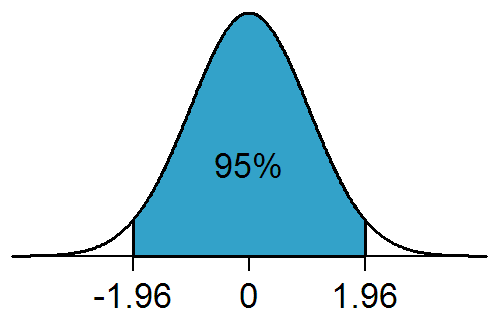

<center>

```{r setup, include=FALSE}
library(learnr)
library(tufte)
library(rio)
library(visdat)
library(fs)
library(ggplot2)
library(DiagrammeR)
library(r2symbols) # cheatsheet here: https://r2symbols.obi.obianom.com/symbols/
library(learnr)
library(gradethis)
library(car)
library(finalfit)
library(skimr)
library(lattice)

gradethis::gradethis_setup()
load("./data/df.rdata")
df <- df_no_dups
df$Mother_smoke <- ifelse(df$Mother_smoke == 0, "No", df$Mother_smoke)
df$Mother_smoke <- ifelse(df$Mother_smoke == "_Yes", "Yes", df$Mother_smoke)
#df <- rio::import("https://flexiblelearning.auckland.ac.nz/data-analysis/menu/1/files/simple_sids_epiinfo2.xlsx")
#dir.create("./data")
#rio::export(df, "./data/sids.xlsx")

# tutorial_options(
#   exercise.timelimit = 60,
#   # A simple checker function that just returns the message in the check chunk
#   exercise.checker = function(check_code, ...) {
#     list(
#       message = eval(parse(text = check_code, ...)),
#       correct = logical(0),
#       type = "info",
#       location = "append"
#     )
#   }
# )
knitr::opts_chunk$set(error = TRUE)
```

<br> </br>


</center>

## Getting started

Today, we will learn how to:

-   Plot and summarise the relationships between continuous variables.
-   Interpret regression models
-   Think about which variables we should adjust for in regression
    models
-   Interpret the model fit and summary statistics of models.

We will be leaning on the
[`finalfit`](https://finalfit.org/){target="_blank"} and
[`car`](https://socialsciences.mcmaster.ca/jfox/Books/Companion/index.html){target="_blank"}
libraries to do these analyses.

## Before we start

We’ll be working on the cot death data again, which on a case-control study. The critical elements of a case-control study are the definition of cases and controls (the disease), and the potential exposures.

Here, we will be focusing on the relationships between continuous
variables, such as:

-   Gestation at which the baby was born (weeks)

-   Birth weight of the baby in grams

-   The mother's age in years

Although these were not the primary aim of the study, we can nevertheless look at these relationships using regression.

When it comes to analysing *continuous* outcomes, for binary categorical exposures, we can use *t*-tests, however, if we have continuous exposures, we really need regression, and if we have more than two groups, we use a special type of regression called 'ANOVA' or analysis of variance. Today, we will be using *linear* regression, which is most often used for continuous outcomes that are not counts. For count data, we usually use Poisson regression or a variant on this theme.

## Set-up

<center>

{width="500"}

</center>

To set-up our session for analysis and call the necessary libraries.
Note, that I'm using `pacman::p_load()` in place of `install.packages()`
and `library()`. The `pacman` library shortens this procedure, and
`p_load()` will look for a package and install it if it can't be found on the machine.
It will also put it on the search path, like the `library()` command
does. These tutorials don't allow loading or installing packages
for security reasons, so the code is given below for reference.

```{r lib_load, eval=FALSE}
if(!require(pacman)) install.packages("pacman")

pacman::p_load(rio, ## package for importing data easily
               visdat, skimr, # data exploration 
               car, #fancy plots
               httr,
               ggplot2, #fancy plots
               dplyr, 
               rmdHelpers,
               kableExtra,
               epiDisplay,
               finalfit) # This is for making regression tables.
```

We will assume we have imported our data, corrected errors and checked for duplicates just as we have done in previous sessions. We won't repeat it here! 🥱

Let's crack on!🤠

## Scatter plot

We want to know whether the length of time a woman is pregnant (**gestation**) influences the **birth weight** of their child.

First of all, let's examine the **crude** relationship with some plots. When you have both a continuous exposure and outcome, then a scatterplot is the most appropriate. A scatterplot alone is difficult to interpret, so it is worthwhile adding a regression line and a smoother. Traditionally, the outcome is on the vertical or *y*-axis, and the exposure is on the horizontal or *x*-axis.

<span style="color: red;">NB: A frequent error students make is mixing up the $x$ and $y$ axes between exposures and outcomes.</span>

The `car::scatterplot()` function does all this by default. The **slope** of the line gives an indication of the **strength** of association.


```{r scatter1, exercise = TRUE}
car::scatterplot(Birth_wt ~ Gestation, data = df)
```

#### Question


```{r scatter_1, echo=FALSE}
question("Which of these statements about the solid blue line is **true**?",
  answer("It is the average change in birth weight for a one unit change in gestational age.", correct = TRUE),
  answer("It's the smoother or moving average", message = "No. that is the dashed blue line."),
  answer("It shows the average change in gestational age for one unit change in birth weight.", message = 'No. The condition here is wrong. <span style="color: red;">You have mixed up the axes!</span>'),
  allow_retry = TRUE
)
```

```{r scatter_2, echo=FALSE}
question("Roughly, what is the average birthweight at 35 weeks gestation?",
  answer("2000g", message = "No. At 35 weeks, the lower border of the shaded band is ~2000g but this is not the regression line"),
  answer("2500g", correct = TRUE, message = "Yes, the regression line, which gives the average birthweight, is ~2500 g at 35 weeks 😸"),
  answer("3000g", message = "No. At 35 weeks, the upper border of the shaded band is ~3000g but this is not the regression line"),
  allow_retry = TRUE
)
```

We can also account for other variables. If `Mother_smoke` is thought to be an important variable, since babies of smokers are known to be low birth weight, we can stratify our plot by smoking.

```{r scatter2, exercise = TRUE}
car::scatterplot(Birth_wt ~ Gestation | Mother_smoke, data = df)
```

We can also add **units** to our $x$ and $y$ axes by adding some additional arguments
to the function call (`xlab` and `ylab`).

```{r scatter3, exercise = TRUE}
car::scatterplot(Birth_wt ~ Gestation | Mother_smoke, data = df,
xlab = "Gestation (weeks)", ylab = "Birth weight (grams)")
```


#### Questions


Run code to produce a scatter plot of the association between gestation period (`Gestation`; independent variable) and birth weight (`Birth_wt`; dependent variable), stratified by ethnic group (`Ethnic`). Use the code format given.
```{r scatter_by, exercise = TRUE}
# car::scatterplot(y ~ x | group, data = dataset)
```

```{r scatter_by-solution}
car::scatterplot(Birth_wt ~ Gestation | Ethnic, data = df)
```

<div id="scatter_by-hint">
**Hint:** What are `y`, `x`, `group` and `dataset` for this question?
</div>

```{r scatter_by-check}
grade_this_code("Well done. It’s an important skill to make scatter plots in R")
```

```{r scatter_3, echo = FALSE}
question("Which ethnic group has the steepest slope?",
  answer("European", message = "No. Try again"),
  answer("Māori", message = "No. Try again"),
  answer("Pacific", correct = TRUE, message = "It is a subtle difference in slopes, but Pacific is steepest. Well done!"),
  allow_retry = TRUE
)
```
(**Hint:** Look at where each regression line starts (left-hand side) and ends (right-hand side))

## Crude Linear Regression model

To estimate the **strength** of association between birth weight and gestational age, run the following code:

```{r crude_lr1, exercise = TRUE}
model <- lm(Birth_wt ~ Gestation, data = df)
summary(model)
```

The first line creates the `model` object and the second prints a summary of the `model`.

The line of the model is defined by 2 major parameters:  
-   slope  
-   *y*-intercept

The `Estimate` column gives two parameters:  
-   `(Intercept)` is the $y$-intercept or average value of $y$ when $x$ is 0.
-   `Gestation` is the slope or $\beta$ coefficient, which indicates the average change in $y$ for a one unit change in $x$. 🥸
  

#### Questions


```{r crude_lr_1, echo=FALSE}
question("You should get an `Estimate` value of 192 for `Gestation` (rounded to the nearest whole number). Interpret the meaning of this figure.",
  answer("Birthweight is *exactly* 192 g heavier for every 1-week increase in gestation", message = "No. This may not be correct for all babies. Try again 🥺"),
  answer("Birthweight is, *on average*, 192 g heavier for every 1-week increase in gestation", correct = TRUE, message = "This is the average increase in the outcome (birthweight) per week (one unit) increase in the gestational age 🤓"),
  answer("Gestation is *exactly* 192 weeks longer for every 1g increase in birthweight", message = "No. Gestation is not the outcome. Try again 🙄"),
  answer("Gestation is, *on average*, 192 weeks longer for every 1g increase in birthweight", message = "No. Gestation is not the outcome. Try again 😖"),
  allow_retry = TRUE
)
```

```{r crude_lr_2, echo=FALSE}
question("What is the average weight of a baby at 40 weeks gestation, predicted by the linear model?",
  answer("40*192 g", message = "No. That would give a very heavy baby! You need to include the intercept in the calculation"),
  answer("(40*192 + 4180)g", message = "No. That adds a positive intercept. The intercept is in fact negative"),
  answer("(40*192 – 4180)g", correct = TRUE, message = "Yes, this gives a birthweight of 3482g consistent with the point on the solid regression line at 40 weeks. This is the *predicted* or average birth weight at 40 weeks.👍"),
  answer("40*(192 – 4180)g", message = "No. That'll multiply the intercept by 40. But the equation for a line is:
$y$ = slope*$x$ + intercept"),
  allow_retry = TRUE
)
```

The [`R-squared`](https://en.wikipedia.org/wiki/Coefficient_of_determination){target="_blank"} gives you an idea of how much variation is explained by the model. It is the proportion of variation explained by the model compared to that of the simplest possible model, a mean of `Birth_wt` in this example. Values close to one indicate good model fit and values close to zero indicate poor fit.

The `Pr(>|t|)` gives you the $P$-value, testing whether each parameter is significantly different from a value of zero. Remember, a slope of zero is a horizontal line, and indicates *no association* or the [*null hypothesis*](https://www.statology.org/null-hypothesis-for-linear-regression/){target="_blank"} or [*independence*](https://openstax.org/books/statistics/pages/3-2-independent-and-mutually-exclusive-events){target="_blank"} between the two variables. The `standard error` can be used to estimate the 95% confidence interval (95% confidence interval = slope +/- 1.96\*standard error). Remember, 1.96 is the 97.5th percentile of the standard normal distribution curve. It is calculated in `R` using the following code:

```{r qnorm1, exercise = TRUE}
qnorm(0.975, mean = 0, sd = 1)
```

[](https://en.wikipedia.org/wiki/1.96)

The
[`Residual standard error`](https://www.statology.org/how-to-interpret-residual-standard-error/){target="_blank"}, despite it's name, is actually the *standard deviation* of the residuals and tells you about the average variation which occurs around the regression line. Unlike the standard error, it is not influenced by sample size.
  

#### Questions
Look at your model summary output and answer the questions below.

```{r crude_lr_3, echo=FALSE}
question("You should get 0.40 for `Multiple R-squared`. What does this tell us?",
  answer("The average squared error is 0.40%", message = "No. 0.40 is not a % and averaging the squared error is used to calculate another model parameter"),
  answer("The average squared error is 40%", message = "No. Averaging the squared error is used to calculate another model parameter"),
  answer("The model explains 0.40% of the variation in birthweight", message = "No. 0.40 is not a %"),
  answer("The model explains 40% of the variation.", correct = TRUE, message = "Yes, 0.40 is a proportion – so it’s 40%"),
  allow_retry = TRUE
)
```

```{r crude_lr_4, echo=FALSE}
question("Which of the following gives the lower 95% confidence interval for the slope of `Gestation`?",
  answer("14.6 – 4.5", message = "No. Subtracting only the `Std. Error` from the `Estimate` would give the lower end of a confidence interval smaller than 95%"),
  answer("14.6 – 1.96*470", message = "No. That would give a negative value!"),
  answer("14.6 + 1.96*4.5", message = "No. That would give gives the upper 95% confidence interval."),
  answer("14.6 – 1.96*4.5", correct = TRUE, message = "It's useful be able to calculate confidence intervals when they're not shown 😁"),
  allow_retry = TRUE
)
```


## Adjusting for confounding: multiple linear regression

Let's imagine now that we wish to account for maternal smoking (`Mother_smoke`), since we believe it is a *shared common cause* of both the outcome (`Birth_wt`) and the exposure (`Gestation`). This is the definition of a *confounder*. We simply add `Mother_smoke` as another term in the right-hand side of the equation for the model.

```{r confounding, echo = FALSE}

response_diag <- DiagrammeR::grViz(diagram = "digraph dot {
      # define node aesthetics
      
      graph [layout = dot, rankdir = LR]
      
      node [fontname = Arial, shape = oval, color = Lavender, style = filled]        
      conf [label = 'Confounder' ]
      
      
      
      subgraph cluster_0 {
        graph[shape = rectangle]
        style = rounded
        bgcolor = Gold
    
        label = 'Hypothesis of interest'
        node [fontname = Arial, shape = oval, color = orange, style = filled]  
      exp [label = 'Exposure' ]
      out [label = 'Outcome' ]
      }
      
# set up node layout
      edge [color = grey] 
      conf -> {exp out}
      exp -> out
      }
      ")

response_diag
```


```{r adj_lr1, exercise = TRUE}
model <- lm(Birth_wt ~ Gestation + Mother_smoke, data = df)
summary(model)
```


#### Questions


```{r adj_lr_1, echo=FALSE}
question("Maternal cigarette smoking (vs. non-smoking) is associated with how much mean difference in birth weight, on average, after adjusting for gestational age?",
  answer("218g more", message = "No. The size of the difference is correct but not the direction. Try again"),
  answer("218g less", correct = TRUE),
  answer("22g more", message = "No. This is the standard error. Mean differences are given in the `Estimate` column"),
  answer("10g more", message = "No. This is the test statistic value. Mean differences are given in the `Estimate` column "),
  allow_retry = TRUE
)
```


```{r scatter_open1, echo=FALSE}
question("Is the `Mother_smoke` variable significantly associated with `Birth_wt`?",
         answer("Yes", correct = TRUE, message = "correct, the P-value is less than 0.05"),
         answer("No", message = "A low P-value for the beta coefficient indicates a significant association."),
         answer("I don't know", message = "At least you're honest! Try again! 😵"),
         allow_retry = TRUE
         )
```

How much has the $\beta$ coefficient for `Gestation` changed with the addition of `Mother_smoke`?
Enter a value (to 1 decimal place) here:
```{r adj_lr_2, exercise = TRUE}

```

```{r adj_lr_2-solution}
5.6
```

<div id="adj_lr_2-hint">
**Hint:** What’s the difference between the crude and adjusted coefficients?
</div>

```{r adj_lr_2-check}
grade_this( {
if(isTRUE(all.equal(.solution, .result, tolerance = 0.05) )){
    pass("Correct! 191.550 g (crude coefficient) – 185.92 (adjusted coefficient) = 5.6g 🤡")
  }
  fail("Try again")
})
```

```{r adj_lr_3, echo=FALSE}
question("How much change (minimum) in the $\beta$-coefficient (%) is the minimum likely to represent substantial confounding of the relationship between gestation and birth weight?",
  answer("5%", message = "No. 5% is unlikely to be substantial"),
  answer("10%", correct = TRUE, message = "10% is a rule-of-thumb 👍 😺"),
  answer("20%", message = "No. 20% is substantial. But lower than this is substantial too. Try again"),
  answer("40%", message = "No. 40% is certainly substantial. But lower than this is substantial too. Try again"),
  allow_retry = TRUE
)
```

How would you adjust the code below to estimate the crude (unadjusted) relationship between `Mother_smoke` and `Birth_wt`?
```{r adj_lr_open1, exercise = TRUE}
model <- lm(Birth_wt ~ Gestation + Mother_smoke, data = df)
summary(model)
```

```{r adj_lr_open1-solution}
model <- lm(Birth_wt ~ Mother_smoke, data = df)
summary(model)
```
<div id="adj_lr_open1-hint">
**Hint:** 
Get rid of the other exposure: here `Gestation` so the association is no longer adjusted for by this extra variable.
</div>
```{r adj_lr_open1-check}
grade_this_code("Great work!🙀")
```

How could we plot the relationship between these two variables (`Mother_smoke` and `Birth_wt`)?
(Hint: a scatter plot is not going to be the best choice here! You may have to think back to past lectures!).
```{r adj_lr_open2, exercise = TRUE}

```
<div id="adj_lr_open2-hint">
**Hint:** 
use the function `boxplot(Continuous_outcome_variable ~ categorical_exposure_variable, data = df)`. Adjust the variable names!
</div>
```{r adj_lr_open2-solution}
boxplot(Birth_wt ~ Mother_smoke, data = df)
```

```{r adj_lr_open2-check}
grade_this_code("Great memory!!🙀")
```

  
**Extra practice!**

Construct a linear model for the association between `Gestation` (independent variable) and birth weight  (`Birth_wt`; dependent variable), adjusted for ethnicity (`Ethnic`). Modify the code given below.
```{r adj_lr_4, exercise = TRUE}
model <- lm(y ~ x1 + x2, data=dataset)
summary(model)
```

```{r adj_lr_4-solution}
model <- lm(Birth_wt ~ Gestation + Ethnic, data = df)
summary(model)
```

<div id="adj_lr_4-hint">
**Hint:** 
-   replace y, x1, x2 and dataset with appropriate names
-   then press submit.
</div>

```{r adj_lr_4-check}
grade_this_code("Great work!🙀")
```

```{r adj_lr_5, echo=FALSE}
question("Compare the slope for `Gestation` before and after adjustment for ethnic group. Does the difference in the slopes suggest that ethnicity is a confounder?",
  answer("Yes", message = "No. When ethnicity is adjusted for, the slope decreases from 191.6 to 189.7. This % change is <10%, suggestive of no confounding"),
  answer("No", correct = TRUE, message = "Yes, when ethnicity is adjusted for, the slope decreases from 191.6 to 189.7. This percentage change is less than 10%, indicating no confounding 😁"),
  allow_retry = TRUE
)
```

## Confidence intervals of predictions from linear models

As we have shown, you can make predictions from linear models with a bit of simple algebra. Things get a bit more complicated when we want to estimate a plausible range of values for our predictions. We have to decide whether the prediction relates to a mean or an observation. The **mean** value of birth weights and **95% confidence intervals**, say of the birth weight of a group of the offspring of Māori women at 37 weeks gestation is given below.

```{r echo = TRUE}
## Confidence interval (mean value)
model <- lm(Birth_wt ~ Gestation + Ethnic, data = df)
predict(model, 
        newdata = data.frame(Ethnic = "Maori", Gestation = 37), 
        interval = "confidence") |> round(0)
```

Contrast this with the range of predicted values for an individual Māori woman's `Birth_wt` of their child with the same characteristics. This is often called a [**prediction interval**](https://rpubs.com/aaronsc32/regression-confidence-prediction-intervals){target="_blank"} to distinguish it from a confidence interval.

```{r echo = TRUE}
## Prediction interval (variability for an individual)
model <- lm(Birth_wt ~ Gestation + Ethnic, data = df)
predict(model, 
        newdata = data.frame(Ethnic = "Maori", Gestation = 37), 
        interval = "prediction") |> round(0)
```

```{r pred_conf, echo=FALSE}
question("Which of the two predictions has the widest interval?",
  answer("Prediction interval", correct = TRUE, message = "Yes, it is the prediction interval, since the variation in the error term needs to be accounted for in addition to the model terms 🥸"),
  answer("Confidence interval", message = "Sorry, this is incorrect. The error terms average out to zero so the interval is smaller for a group than an individual.😩"),
  allow_retry = TRUE
)
```


The latter has a wider interval, as the calculation has to incorporate the uncertainty in the residuals as well as the intercept and slope, whereas the former assumes that the mean of the residuals is zero and therefore can be ignored.

## Using `finalfit()` for publication quality regression tables

In epidemiology, it is usual to present a second table after your
table 1. For the *table one* we used `arsenal::tableby()`. Here, we will use `finalfit`. 
We have to tell `finalfit` which variables are our `explanatory` or exposure variables and which is the `dependent` or outcome variable. This is usually a table of regression coefficients and 95%
confidence intervals, and $P$-values. It usually has crude and adjusted
$\beta$ coefficients. The following code will help us here.

```{r finalfit1, exercise = TRUE}
## explanatory variables are exposures of interest and confounders.
## Also known as 'predictors'
explanatory <- c("Mother_age", "Mother_smoke", "Gestation", "Ethnic")

## this is the outcome
dependent <- "Birth_wt"

## This little bit of code saves a world of pain and runs
## all the crude and adjusted models and summarises into
## a table. Wonderful...!!
## Note: finalfit() will select the appropriate model
## depending on the nature of the outcome variable
## Here: continuous or numeric variable = linear regression.
## You have to be cautious about this, as the selected model may not be
## the one you are intending to use. Be careful and study the 
## finalfit() documentation when you are using this in the wild!

df |>
  finalfit::finalfit(dependent, 
                     explanatory, metrics = FALSE) -> regression_table

## Fancy format for cutting and pasting into Excel
regress_tab <- knitr::kable(regression_table, row.names = FALSE,
                            
                            align = c("l", "l", "r", "r", "r"))

## Puts output into viewer so that it can be cut and pasted into Excel, 
## then Word.
regress_tab |> kableExtra::kable_styling()

```


#### Questions
What is the mean difference in birth weight of smokers' babies, compared to non-smokers', after accounting for confounders?
```{r finalfit_1, exercise = TRUE}

```

```{r finalfit_1-solution}
191
```

```{r finalfit_1-check}
grade_this( {
if(isTRUE(all.equal(.solution, .result, tolerance = 0.1) )){
    pass("Yes. On average, smoker’s babies are 191g lighter as -191 is the coefficient for `Mother_smoke`=Yes in the multivariable column")
  }
  fail("'Accounting for confounders' refers to the multivariable model. What is the $\beta$ coefficient for `Mother_smoke`=Yes?")
})
```

```{r finalfit_2, echo=FALSE}
question("From the table above, describe the relationship between `Mother_age` and `Birth_wt`?",
  answer("The crude and adjusted associations are both positive", message = "Yes, the crude association is positive (P < 0.001). But as the adjusted coefficient is not significant (P = 0.137), it's better to say that there is no adjusted association"),
  answer("The crude association is positive and significant but there's no adjusted association", correct = TRUE, message = "Because the coefficient is significant (P < 0.001) for the crude, but is not significant for the adjusted association (P = 0.137)"),
  allow_retry = TRUE
)
```

On average, after adjustment for confounders, how much weight does a baby put on for each additional week of gestation?
```{r finalfit_3, exercise = TRUE}

```

```{r finalfit_3-solution}
185.31
```

```{r finalfit_3-check}
grade_this( {
if(isTRUE(all.equal(.solution, .result, tolerance = 0.05) )){
    pass("Yes!")
  }
  fail("'Adjusting for confounders' refers to the multivariable model. What is the beta coefficient for `Gestation`?")
})
```

```{r finalfit_4, echo=FALSE}
question("The correct ending to the statement, 'On average, Pacific babies are heavier than…' is:?",
  answer("All other ethnic groups by 75 g", message = "No. The 75g difference is for comparing Pacific with the reference group, which isn't European and Māori combined"),
  answer("European by 75g", correct = TRUE, message = "Yes, the 75g difference is for comparing Pacific with the reference group, which is European (as '-' is in the European row)"),
  answer("Māori by 75g", message = "No. The 75g difference is for comparing Pacific with the reference group, which is not Māori"),
  allow_retry = TRUE
)
```

"Extra for experts" question:
By how much heavier, on average, are Pacific babies compared to Māori babies (answer to the nearest whole number, in grams)?
```{r finalfit_5, exercise = TRUE}

```

```{r finalfit_5-solution}
126
```

<div id="finalfit_5-hint">
**Hint:** The Māori and Pacific coefficients are both being compared with European. So you need to combine them in some way
</div>

```{r finalfit_5-check}
grade_this( {
if(isTRUE(all.equal(.solution, .result, tolerance = 0) )){
    pass("Yes. Looks like you’re an expert! Compared to European, on average, Māori babies are 50.9g lighter and 75.1g heavier. So compared to Māori, Pacific babies will be 50.9 + 75.1 = 126g heavier (on average)")
  }
  fail("Try again")
})
```

In the code below, to produce model metrics change `metrics` from FALSE to TRUE. You will also need to specify the `dependent` and `explanatory` variables.

```{r finalfit6, exercise=TRUE}
df |>
  finalfit::finalfit(dependent,
  explanatory, metrics = FALSE) -> regression_table

# print output
# This is regression table
regression_table[[1]]

#These are metrics
regression_table[[2]]

```

<div id="finalfit6-hint">
**Hint:** Add in same dependent and explanatory variables as for the first `finalfit()` example.
Change `metrics = TRUE` to `metrics = FALSE`.
</div>


```{r finalfit6-solution}
explanatory <- c("Mother_age", "Mother_smoke", "Gestation", "Ethnic")

dependent <- "Birth_wt"

df |>
  finalfit::finalfit(dependent,
  explanatory, metrics = TRUE) -> regression_table

# print output
# This is regression table
regression_table[[1]]

#These are metrics
regression_table[[2]]
```


What proportion of the overall variation in the data is explained by the model?
```{r finalfit_7, exercise = TRUE}

```

```{r finalfit_7-solution}
0.44
```

```{r finalfit_7-check}
grade_this( {
if(isTRUE(all.equal(.solution, .result, tolerance = 0.1) )){
    pass("Correct! This is the R-squared")
  }
  fail("Try again")
})
```

## Model fit

How well a model fits the data can be assessed with a **marginal model plot**, which shows the relationship between the model predicted and observed data.

Run this code to produce a marginal model plot:

```{r modelfit1, exercise = TRUE}
model <- lm(Birth_wt ~ Gestation + Mother_age, data=df)
summary(model)

car::marginalModelPlots(model) # Produces a marginal model plot

```

What is the nature of the overall fit of the model to the data?
-   A good fit is indicated by good alignment between `Data` (blue line) and the `Model` (red line). That is, with perfect model fit, you should see both lines very close or superimposed on each other.
-   Poor fit is indicated by poor alignment between these lines. 
-   Often, you see that for more extreme or outlying values of an exposure,
there is deviation of the `Data` from the `Model`. This may not invalidate your model, but would be important to be aware of, and may be worthwhile highlighting to the readers that you are communicating with in your manuscript.


#### Questions


```{r modelfit_1, echo=FALSE}
question("Which terms in the model align with the data?",
  answer("`Gestation` only", message = "No. For the other plots, is there good alignment between the *data* (blue) and *model* (red) plots? Try again"),
  answer("`Mother_age` only", message = "No. For the other plots, although there is some deviation between the *data* (blue) and *model* (red) plots around the extremities, this is minor. Try again"),
  answer("The overall model (predicted values) only", message = "No. For the other plots, is there good alignment between the *data* (blue) and *model* (red) plots? Try again"),
  answer("`Gestation`, `Mother_age` and the overall model (predicted values)", correct = TRUE, message = "This is because, for all 3 plots, there’s good alignment (although not perfect) between the *data* (blue) and *model* (red) plots"),
  allow_retry = TRUE
)
```

We want to construct a marginal model plot for the association between `Gestation` and `Birth_wt`, adjusted for ethnic group. A potential problem with `car::marginalModelPlots()` is that it throws a wobbly if character variables are put into regression models. Although the modelling function (`lm()`) might work fine, the plot function (`car::marginalModelPlots()`) won't.
Before we do so, use the `str()` function, with the code format given, to check what sort of variable `Ethnic` is (character or factor).

```{r modelfit_2, exercise = TRUE}

dataset$variable |> str()

```

```{r modelfit_2-solution}
df$Ethnic |> str()
```

<div id="modelfit_2-hint">
**Hint:** What should you replace `dataset` and `variable` with?
</div>

```{r modelfit_2-check}
grade_this( {
if(isTRUE(all.equal(.solution, .result, tolerance = 0) )){
    pass("Good!")
  }
  fail("Try again, using `df$Ethnic |> str()`")
})
```

If `df$Ethnic` is a character variable, you need to first convert it to a factor variable, rerun the model function call and then the plot function. Adapt the code below to model the relationship between `Birth_wt` (outcome) and `Gestation` and `Ethnic` (exposures) so that it produces an appropriate diagnostic plot.

```{r modelfit_3, exercise = TRUE}

dataset$ethnic <- dataset$ethnic |> as.factor()
model <- lm(Birth_wt ~ Gestation, data=df)
car::marginalModelPlots()

```

```{r modelfit_3-solution}
dataset$Ethnic <- dataset$Ethnic |> as.factor()
model <- lm(Birth_wt ~ Gestation + Ethnic, data = df)
car::marginalModelPlots(model)
```

<div id="modelfit_3-hint">
**Hint:**  
Line 1: What should `dataset` be? What goes after `$`?  
Line 2: Change code so that `Ethnic` is adjusted for  
Line 3: What goes in the brackets?
</div>

```{r modelfit_3-check}
grade_this( {
if(isTRUE(all.equal(.solution, .result, tolerance = 0) )){
    pass("Well done! 🤓")
  }
  fail("Try again, using the code format given 😳")
})
```


## Homework

Is the duration of pregnancy influenced by the mothers' age?

Run a regression model to find out.

To find out, repeat the above tasks with `Mother_age` as the exposure and `Gestation` as the outcome.

Ensure you can interpret the output.