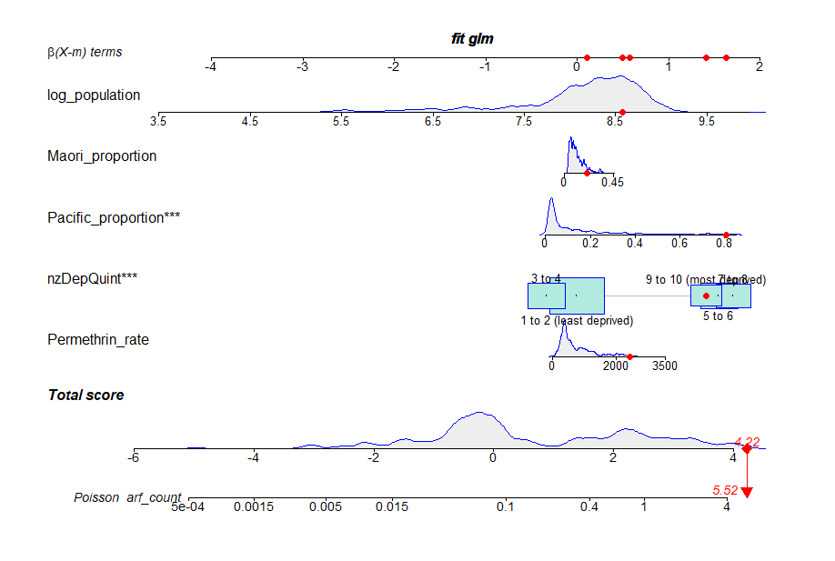
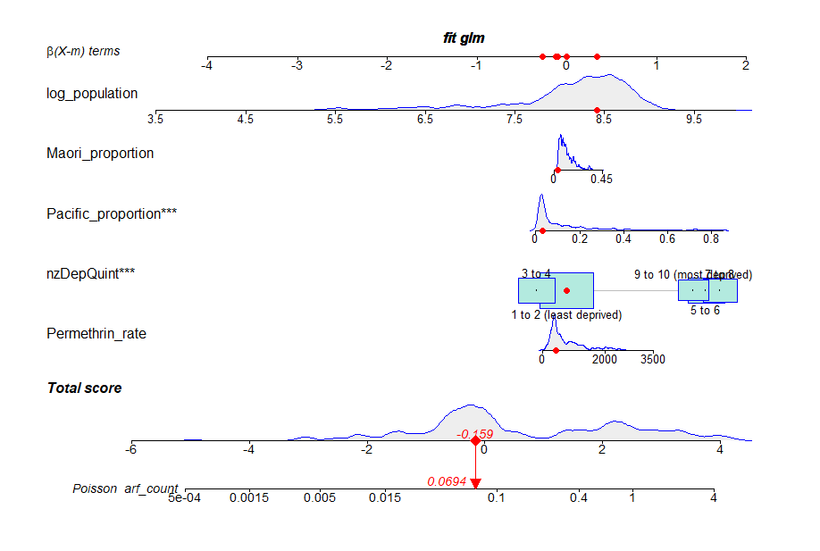

```{r setup, include=FALSE}
library(learnr)
library(tufte)
library(rio)
library(visdat)
library(fs)
library(ggplot2)
library(DiagrammeR)
library(r2symbols) # cheatsheet here: https://r2symbols.obi.obianom.com/symbols/
library(learnr)
library(gradethis)
library(skimr)
library(lattice)
library(epiDisplay)
library(finalfit)
library(vembedr)
library(png)
library(car)
library(pryr)
library(performance)
gradethis::gradethis_setup()
#setwd("./data")
# load("./Cloud/data/ARF_permethrin.rdata")
load("./data/ARF_permethrin.rdata")
# library(readxl)
# df <- read_xlsx("C:\\Users\\jslu002\\Desktop\\for_shiny.xlsx")
df <- data.frame(for_shiny)
df <- df[!duplicated(df),]

names(df) <- c("arf_count", "population", "Pacific_proportion",
               "Maori_proportion", "Permethrin_rate", "Suburb",
               "nzdep_decile", "arf_rate")

## 5 groups instead of 10
df$nzDepQuint <- cut(df$nzdep_decile, breaks = c(-Inf, 2, 4, 6, 8, Inf),
                     labels = c("1 to 2 (least deprived)",
                                "3 to 4",
                                "5 to 6",
                                "7 to 8",
                                "9 to 10 (most deprived)")) 

df$log_population <- log(df$population)

fit <- glm(arf_count ~ Permethrin_rate +
             nzDepQuint +
             Pacific_proportion +
             Maori_proportion, 
           offset = log_population,
           family = poisson(link = "log"),
           data = df)

fit1 <- glm(arf_count ~ Permethrin_rate +
             nzDepQuint +
             Pacific_proportion +
             Maori_proportion + offset(log(population)),
           family = quasipoisson(link = "log"),
           data = df)

fit5 <- glm(arf_count ~ Permethrin_rate +
             nzDepQuint +
             Pacific_proportion +
             Maori_proportion + offset(log(population)),
           family = quasipoisson(link = "log"),
           data = df)

fit_qp <- glm(arf_count ~ I(Permethrin_rate/1000) +
             nzDepQuint +
             Pacific_proportion +
             Maori_proportion + offset(log(population)),
           family = quasipoisson(link = "log"),
           data = df)

mycounter <- 0
Qnum <- function(count = mycounter){
  mycounter <<- mycounter + 1
  paste0("Question ", mycounter)
}

knitr::opts_chunk$set(error = TRUE)
```


<center>
Scabies swimming in mineral oil at 40x magnification.

```{r echo = FALSE}
embed_url("https://www.youtube.com/watch?v=tR0p9s2Lzuk")
```

Live mites on human skin (courtesy of Berghofer QIMR).
```{r echo = FALSE}
embed_url("https://youtu.be/aarPJyjkW2w")
```

<!-- [](https://youtu.be/aarPJyjkW2w){target="_blank" width="600"} -->

</center>

## Getting started

This session, we will focus on modelling of count outcomes in
epidemiology.

We will learn how to:

-   Plot the relationships between count variables and other variables
-   Run and interpret regression models
-   Interpret the model fit and summary statistics of models
-   Check models for over-dispersion
-   Consider the effects of multi-collinearity on exposure-disease
    relationships
-   Use regression nomograms to better understand and communicate the results of regression models
  <br></br>
  
We will be leaning on the following libraries to do these analyses:

-   [`regplot`](https://cran.r-project.org/web/packages/regplot/index.html){target="_blank"}
-   [`PerformanceAnalytics`](https://cran.r-project.org/web/packages/PerformanceAnalytics/index.html){target="_blank"}
-   [`jtools`](https://jtools.jacob-long.com/){target="_blank"}
-   [`corrplot`](https://r-coder.com/correlation-plot-r/){target="_blank"}
-   [`finalfit`](https://finalfit.org/){target="_blank"} and
-   [`car`](https://socialsciences.mcmaster.ca/jfox/Books/Companion/index.html){target="_blank"}


## Background

We will be diving into a real-life research battle ground today.

<center>

{width="200"}

</center>

There is some controversy about the cause of acute rheumatic fever, 
which is overall rare disease, but it occurs much more commonly in 
Māori and Pacific children than children of any other ethnic group in NZ.

This disease often presents with fever and inflamed joints and can lead to
life-limiting sequelae which include thickened and dysfunctional heart valves.
If these aren't bad enough, it may lead to the need for cardiac surgery
and in some cases, premature death.

<center>

{width="300"}

</center>

The most prevalent explanation in the health sector is that it is caused
by bacterial streptococcal throat infection.

An alternative explanation is that it is caused by the common skin
condition, *scabies*, which has the following skin appearance, which is
easy not to notice. The little crops of raised lumps are scabies and
they are caused by the microscopic mite pictured above.

<center>

{width="300"}

</center>

The treatment for scabies in New Zealand is pictured below, and we will
use records of pharmacy dispensing of this drug as an indirect measure of scabies prevalence in the community.

<center>

{width="300"}

</center>

The proposed mechanism by which scabies causes streptococcal infection
and rheumatic fever is given below:

[{width="700"}](https://linkinghub.elsevier.com/retrieve/pii/S0140-6736(19)31136-5)

[Consequences of scabies
infection](https://linkinghub.elsevier.com/retrieve/pii/S0140-6736(19)31136-5){target="_blank"}


We will be look for the evidence that prescribing for a certain treatment for scabies (the lotion **permethrin**) is linked with **acute rheumatic fever** at a **suburb level** (1 row of data for each suburb). Since the counts of acute rheumatic fever over a certain period constitute a 'count' variable, **Poisson** regression will be used. The population of the suburb will be used as an **offset** in the model. An [**offset**](https://stats.stackexchange.com/questions/175349/in-a-poisson-model-what-is-the-difference-between-using-time-as-a-covariate-or){target="_blank"} is often used as the denominator when rate values are modelled. For example, here, our outcome is the **count or number of permethrin scripts dispensed in a suburb** divided by the **population of that suburb**. The count of prescriptions is naturally influenced by the population, so this information is incorporated in the model as an **offset**. The offset allows us to model rates rather than counts. Technically, it is a covariate or independent variable whose value of beta coefficient is forced to be one.

Covariates, or potential confounders in the analysis include:

-   The proportion of Māori and Pacific people living in a suburb
-   Socioeconomic deprivation

We will use the counts of acute rheumatic fever by suburb (or census area unit). This information is derived from routine datasets used
in the health sector. The formal write-up of the analysis is
[here](https://onlinelibrary.wiley.com/doi/epdf/10.1111/jpc.14697){target="_blank"}.


#### Brief revision

Count regression is used when an outcome is an integer or count, rather than a continuous measure.

Examples of counts include:

- the number of hospital admissions per day
- the number of people who die each week
- the number of teeth in a person's mouth that affected by decay

In comparison, continuous measures can include fractions or decimals, such as:

- height
- weight
- blood pressure
- age.

Count variables have special characteristics of their distribution which makes linear regression unsuitable. First of all, the distribution is positive, asymmetric and right skewed, meaning a log transformation of the count is necessary. Also, the variance is usually proportional to the count, rather than a constant, as is assumed for linear regression.

### Lecture revision

Our outcome is acute rheumatic fever counts and we will build models to predict this outcome. For the following 3 questions, please answer *True* of *False* in response to each statement.
  
##### **`r Qnum()`**
```{r revision_1, echo = FALSE}
question("The measure of association derived from a count model is an odds ratio.",
answer("True", message = "No, the odds ratio is the measure of association for logistic regression (next tutorial)"),
  answer("False", message = "Yes, the odds ratio is the measure of association for logistic regression (next tutorial). For count regression, the measure of association is the *incidence rate ratio*",  correct = TRUE),
  allow_retry = TRUE
)
```
  
##### **`r Qnum()`**
```{r revision_2, echo = FALSE}
question("Linear regression is unsuitable to use for count outcomes as it may predict negative counts",
  answer("True", message = "Yes, count regression overcomes this problem as the outcome is modelled on a log scale (outcome is log(count)). Exponentiating log(count) predictions gives count predictions that are always positive as exponentiating any non zero number (even negative) gives positive values only", correct = TRUE),
  answer("False", message = "No, linear regression may predict negative counts"),
  allow_retry = TRUE
)
```
  
##### **`r Qnum()`**
```{r revision_3, echo = FALSE}
question("Linear regression is unsuitable for modelling count outcomes since the variance is likely to increase with the mean and the errors will not be normally distributed",
  answer("True", message = "Yes. With count outcomes, the errors will not be normally distributed but linear regression assumes that they are. This happens when the variance increases with the mean. In contrast, count regression is suitable to use when the variance increases with the mean (e.g., when variance = mean)", correct = TRUE),
  answer("False", message = "No. With count outcomes, the errors will not be normally distributed but linear regression assumes that they are. This happens when the variance increases with the mean. In contrast, count regression is suitable to use when the variance increases with the mean (e.g., when variance = mean)"),
  allow_retry = TRUE
)
```


## **Set-up**

To set-up our session for analysis and call the necessary libraries, we’ll use `pacman::p_load()` instead of `install.packages()` and `library()`. The `pacman` library shortens this procedure, and
`p_load()` will look for a package and install it if it can't be found. It will also put it on the search path, like the `library()` command does. We won't run this code, as it will mess up our tutorial, but it is essential for getting this running on a local machine or posit cloud.

```{r library_1, eval=FALSE }

if(!require(pacman)) install.packages("pacman")
pacman::p_load(tidyverse, 
               epiDisplay, 
               visdat, # missing data visualisation
               skimr, # summarise data frame
               lattice, # basic histograms
               jtools, # exponentiate beta coefficients
               ggstance,
               broom.mixed,
               finalfit, # final tables
               dplyr,
               kableExtra,
               car,
               MixAll,
               regplot, # nomograms
               PerformanceAnalytics,
               corrplot, 
               performance) # overdispersion check
```
  
View the dataframe; called `for_shiny`. Notice that there’s 1 row for each suburb:

```{r view_1, exercise = TRUE}

for_shiny
```
  
List the variable names:
```{r names_1, exercise = TRUE}
for_shiny |> names()
```
  
Rename our dataframe as `df`. Then rename the variables so they're more 
understandable. Although this seems tedious, it really makes life easier and 
reduces confusion.

```{r rename_1, exercise = TRUE}
df <- for_shiny # Rename dataframe

# Rename variables
names(df) <- c("arf_count", "population", "Pacific_proportion",
               "Maori_proportion", "Permethrin_rate", "Suburb",
               "nzdep_decile", "arf_rate")
df |> names() # Check that the variables have been renamed
```
  
### **Data integrity checks**  

### 1) Duplicates
There should be 1 row for each `Suburb`, so check if this variable is duplicated.
```{r duplicate_1, exercise = TRUE}
stopifnot(df[df$Suburb |> duplicated(),] == 0)
```

  
If `Suburb` is duplicated, the `R` output would read: `df[df$Suburb |> duplicated(),] == 0 are not all TRUE`.  
Are there any duplicates?  

  
### 2) Ranges
```{r rename2, include=FALSE, eval = TRUE}
names(df) <- c("arf_count", "population", "Pacific_proportion",
               "Maori_proportion", "Permethrin_rate", "Suburb",
               "nzdep_decile", "arf_rate")
```

```{r range_1, exercise = TRUE}
df |> skim()
```
Are there any implausible extreme values (check `p0` [minimum] and `p100` [maximum])?
  


##### **`r Qnum()`**
From the summary data above, what is the *variance* of `arf_count`? Note, *variance* is standard deviation squared. 
```{r variance_2, exercise = TRUE}
```
```{r variance_2-solution}
var(df$arf_count)
```
::: {#variance_2-hint}
**Hint:** Variance = (standard deviation)^2
:::
```{r variance_2-check}
grade_this( {
if(isTRUE(all.equal(.solution, .result, tolerance = 0.1) )){
    pass("Yes, variance = (standard deviation)^2")
  }
  fail("Please try again")
})
```
  
### 3) Missing data
```{r missing_1, exercise = TRUE}
df |> vis_miss(sort_miss = TRUE)
```
Do you see any missing data?

## **Univariable distributions: histograms**
Use the `histogram()` function for these.  
  
Outcome as a *count*: `arf_count`
```{r histogram_1, exercise = TRUE}
df$arf_count |> histogram()
```
  
Outcome as a *rate*: `arf_rate`
```{r histogram_2, exercise = TRUE}
df$arf_rate |> histogram()
```

  
##### **`r Qnum()`**
```{r histogram_3, echo = FALSE}
question("To decide what type of regression to use for our models, we need to check for overdispersion.  
Look at your first histogram above – for `arf_count`. In the previous section, you estimated the mean of  `arf_count` displayed from using the `skim` function (`0.55`) and compare it with the variance you calculated (`1.36`).\n\n
Which of the following, if any, is consistent with under-dispersion?",
  answer("Variance > mean", message = "Yes. The variance (1.36) is substantially greater than the mean (0.55).", correct = TRUE),
  answer("Long tail of the distribution only", message = "No. A long tail is a feature of a power distribution. Please try again"),
  allow_retry = TRUE
)
```

A formal check for overdispersion in Poisson regression models can be estimated by running the `check_overdispersion(x)` function from the 
`performance` package. The argument `x` is the Poisson regression model object which will be estimated later. We will see later that even though there is a greater variance than mean, a formal statistical test of difference in the conditional (on covariates) mean and variance of `arf_count` from the model is not statistically significant. 

##### **`r Qnum()`**
```{r histogram_4, echo = FALSE}
question("Your results should point to evidence of over-dispersion. Given this observation, what type of regression would improve model fit?",
  answer("Linear", message = "The outcome, ARF count, comprises whole numbers, even if there is overdispersion. So linear regression is unsuitable. Please try again"),
  answer("Poisson", message = "No, as there is overdispersion, we need to account for this by modelling a variant of Poisson regression. Please try again"),
  answer("Quasi-Poisson regression or negative-binomial", message = "Yes, these forms of regression are used for accounting for over or under dispersion when modelling outcomes comprising counts", correct = TRUE),
  answer("Logistic regression", message = "This is used when the outcome is binary (2 values only), but our outcome (ARF count) comprises positive integers with more than 2 values. Please try again"),
  allow_retry = TRUE
)
```

First, we will check the distribution of our outcome
  
Exposure: `permethrin_rate`
```{r histogram_5, exercise = TRUE}
df$Permethrin_rate |> histogram()
```

##### **`r Qnum()`**  
Then the distribution of our confounders. Adjust the following code to plot three histograms of the following variables.
```{r histogram_6, exercise = TRUE}
df$Pacific_proportion 
df$Maori_proportion
df$nzdep_decile 
```
```{r histogram_6-solution}
df$Pacific_proportion |> histogram()
df$Maori_proportion |> histogram()
df$nzdep_decile |> histogram()
```
  
::: {#histogram_6-hint}
**Hint:** You need to use the `histogram()` function
:::


```{r histogram_6-check}
grade_this_code("Good, you can now visualise the distribution of continuous and count variables with histograms!")
```
  
##### **`r Qnum()`**  
```{r histogram_7, echo = FALSE}
question("How would you interpret the histogram for `Pacific_proportion`?",
  answer("The proportion of Pacific people is evenly distributed in suburbs in Auckland", message = "No, in fact, you can see that it is very uneven! Please try again"),
  answer("Most suburbs in Auckland have a high proportion of Pacific people living in them", message = "No, please reconsider the plot and try again. Please try again"),
  answer("A small number of suburbs in Auckland have a very high proportion of Pacific people living in them", message = "Yes, this is what the histogram shows.", correct = TRUE),
  allow_retry = TRUE
)
```

When a categorical variable has many groups, it’s common to combine these to avoid sparse data. For `nzdep_decile`, which has 10 categories (last histogram above), we’ll combine consecutive pairs to create quintiles (5 groups). The breaks are included in the category. So, for example, the first category includes any value from negative infinity (`-Inf`) to 2. Any value greater than two will be incorporated in the next category and so on.
```{r histogram_8, exercise = TRUE}
# 5 groups instead of 10
df$nzDepQuint <- cut(df$nzdep_decile, breaks = c(-Inf, 2, 4, 6, 8, Inf),
                     labels = c("1 to 2 (least deprived)",
                                "3 to 4",
                                "5 to 6",
                                "7 to 8",
                                "9 to 10 (most deprived)"))

# Check the frequency of our 5 groups
epiDisplay::tabpct(df$nzDepQuint, df$nzdep_decile)
```

## **Bivariate associations: scatterplots**
Before undertaking any regression analysis, it is useful to visualise the 
relationships between key exposure, confounding and outcome variables.

Use the `car::scatterplot()` function.
  
####Exposure and outcome
```{r scatterplot_1, exercise = TRUE, warning=FALSE}
car::scatterplot(arf_rate ~ Permethrin_rate, data = df)
```

##### **`r Qnum()`**  
```{r scatter_1, echo = FALSE}
question("How would you interpret the scatter plot between `Permethrin_rate` dispensing and `arf_rate`?",
  answer("No evidence of association", message = "No, this would be expected if the regression line were horizontal."),
  answer("Negative association", message = "No, if that were the case, we would expect to see a line extend from the top right hand corner to the bottom left."),
  answer("A positive association", correct = TRUE, message = "Yes, the greater the permethrin dispensing, the greater the rate of rheumatic fever, so the gradient or slope or beta coefficient term is positive"),
  allow_retry = TRUE
)
```

##### **`r Qnum()`**  
Complete the following lines of code to make scatter plots between covariates and the outcome `arf_rate`.  
```{r scatterplot_2, exercise = TRUE}
arf_rate ~ nzdep_decile
arf_rate ~ Pacific_proportion 
arf_rate ~ Maori_proportion 
```

::: {#scatterplot_2-hint}
**Hint:** You need to use the `car::scatterplot()` function. You'll also need to fill the `data = ...` argument, so that `R` knows which variables in which `data.frame` you are referring to.
:::

```{r scatterplot_2-solution}
car::scatterplot(arf_rate ~ nzdep_decile, data = df)
car::scatterplot(arf_rate ~ Pacific_proportion, data = df)
car::scatterplot(arf_rate ~ Maori_proportion, data = df)
```


```{r scatterplot_2-check}
grade_this_code("Good! You can now visualise the distribution of two continuous variables!")
```

##### **`r Qnum()`**  
```{r scatter_2_int, echo = FALSE}
question("How would you interpret the scatter plot between the potential confounders and `arf_rate`?",
  answer("No evidence of association in any variables", message = "No, this would be expected if all the regression lines were horizontal"),
  answer("All Negative associations", message = "No, we would expect to see lines in the top right hand corner going to the bottom left."),
  answer("All positive associations", correct = TRUE, message = "Yes, the slope of the line is in the positive direction (more x associated with greater y)."),
  answer("Something else", correct = TRUE, message = "No, please try again!"),
  allow_retry = TRUE
)
```

**Quick method to make several scatterplots**  
There is a method of making these scatterplots in one line of code! 

Use the `PerformanceAnalytics::chart.Correlation()` function to get all correlations in one chart. 
Here, we select five continuous variables from `df` and put them into a `data.frame` called `my_data`. Then, we apply our `PerformanceAnalytics::chart.Correlation()` function to `my_data` to get histograms, scatter plots and Pearson correlation coefficients.


```{r scatterplot_4, exercise = TRUE, warning = FALSE}
## Select variables of interest into new data.frame
my_data <- df[, c("Pacific_proportion", 
                  "Maori_proportion", 
                  "Permethrin_rate", 
                  "nzdep_decile", 
                  "arf_rate")]

## Chart the correlations and regressions 
## and distributions of each variable.
PerformanceAnalytics::chart.Correlation(my_data, 
                                        histogram = TRUE, 
                                        pch = 19)
```
  
##### **`r Qnum()`**
```{r scatterplot_5, echo = FALSE}
question("What is the Pearson correlation coefficient (`r`) for the association between Pacific proportion and permethrin rate?",
  answer("`r` = 0.55", message = "No, this is the correlation between `Pacific_proportion` and `Maori_proportion`"),
  answer("`r` = 0.66", message = "No, this is the correlation between `Permethrin_rate` and `Maori_proportion` and `arf_rate`"),
  answer("`r` = 0.88", message = "Yes, the row for `Pacific_proportion` intersects with the column for `Permethrin_rate` at the cell that has 0.88 in it. A correlation of 0.88 is extremely high and suggests a very strong association.", correct = TRUE),
  answer("`r` = 0.79", message = "No, this is the correlation between `Permethrin_rate` and `nzdep_decile`"),
  allow_retry = TRUE
)
```

## **Regression**
We will build a Poisson regression model with our outcome as `arf_count` and exposure as `Permethrin_rate`. To adjust for population size, we will include `log_population` as an offset. We will also adjust for NZDep quintile (`nzDepQuint`), `Pacific_proportion` and `Maori_proportion`.

Run the following code using the `glm()` (**g**eneralised **l**inear **m**odel) function to make a Poisson regression model of `arf_count` with all other risk factors as independent variables or covariates.

```{r regression_1, exercise = TRUE}
## Make offset variable
df$log_population <- log(df$population)

## Build model
fit <- glm(arf_count ~ Permethrin_rate +
           nzDepQuint +
           Pacific_proportion +
           Maori_proportion, 
           offset = log_population,
           family = poisson(link = "log"),
           data = df)

## Print summary of model
summary(fit)

## check for overdispersion
performance::check_overdispersion(fit)

```
  
Look at the term, `offset = log_population`, in the model. With counts (`arf_count`) as the outcome, having `log_population` as the offset makes the model represent a *rate* (count per unit *population*).  The overdispersion test is a test of the residual deviance differing substantially from the degrees of freedom in the model. Here, it greater than 0.05, so not significant. Hence, we can stick with our Poisson model.

Check your understanding.

##### **`r Qnum()`**
```{r regression_2, echo = FALSE}
question("Commonly, offsets are based on the time spent observing each outcome (observation period). When would it be appropriate to include `log(time in years)` as an offset? (select all that apply)",
  answer("If the observation period differed by suburb", message = "First, if the observation period differed by suburb, then  larger numbers of cases would be likely to in suburbs observed for longer periods. Having an offset based on time accounts for this.", correct = TRUE),
  answer("If we wanted our outcome to be rates based on counts per *year*", message = "Second, with counts (`arf_count`) as the outcome, adding `log(time)` as the offset makes the model represent a rate in counts per *year*.", correct = TRUE),
  answer("If we had data on the observation period of each suburb", message = "Third, we need the observation period for each suburb.", correct = TRUE),
  answer("None of the above", message = "Please try again"),
  allow_retry = TRUE
)
```
  
##### **`r Qnum()`**
```{r regression_3, echo = FALSE}
question("For `Permethrin_rate`, you should get an `Estimate` value of `0.000294`. What does this tell us?",
  answer("There is, on average, `0.000294` more acute rheumatic fever for every one unit increase in permethrin rate", message = "No. `0.000294` is measured on a natural-log scale. So you need to exponentiate it to give a meaningful interpretation"),
  answer("The incidence rate of acute rheumatic fever is, on average, `0.000294` times higher for every 1-unit increase in permethrin rate", message = "No. `0.000294` is measured on a natural-log scale. So you need to exponentiate it to interpret the figure."),
  answer("There is, on average, `exp(0.000294)` more acute rheumatic fever for every 1-unit increase in permethrin rate", message = "No. Exponentiating this converts it into an incidence rate ratio. However, *`exp(0.000294)` more* does not imply a ratio. We need to use the **times** word to imply a ratio!"),
  answer("There is, on average, `exp(0.000294)` = 1.000294 times higher counts of acute rheumatic fever for every 1-unit increase in permethrin dispensing rate", message = "Yes, exponentiating 0.000294 converts the beta coefficient into an incidence rate ratio. The word **times** suggests a ratio", correct = TRUE),
  allow_retry = TRUE
)
```

While the exponentiated coefficient for permethrin doesn't seem large (1.00035 is a 0.035% change, with a one unit increase of permethrin), the nature of the association may only be understood by also knowing to what extent permethrin dispensing varies in the population. 

From our `skim()` function used earlier, we can see that the minimum values of permethrin dispensing is 0 and the maximum is 3,201. Therefore, the ratio of risk for a change of 3,000 is `exp(0.000294 * 3000)` which equals `2.41`. This means that comparing the lowest to highest suburbs results in a 100 \* (2.41 - 1) = 141% increase in acute rheumatic fever incidence. That apparently weak association is now looking *very strong*. 
  
Exponentiate our model coefficients with the `jtools::summ()` function which 
is called on our model fit object:
```{r regression_4, exercise = TRUE}
jtools::summ(fit, exp = TRUE)
```

This output includes an `exp(Est.)` which are exponentiated beta coefficient or slope terms. 

These are interpreted like **risk ratios**, where a value greater than one indicates higher incidence of the outcome with increasing exposure and a value less than one indicates lower incidence with increasing exposure. The correct term for these is **incidence rate ratios**. 


##### **`r Qnum()`**
```{r regression_5, echo = FALSE}
question("For `Pacific_proportion`, you get an `exp(Est.)` value of 8.02. What does this tell us?",
  answer("There is, on average, 8.02 more acute rheumatic fever for a 1-unit increase in Pacific proportion", message = "No. 8.02 is a rate ratio. What word do we need to add to imply a ratio?"),
  answer("The incidence of acute rheumatic fever is, on average, 8.02 times higher for every 1-unit increase in Pacific proportion", message = "Well done! *8.02 times* implies a ratio and 8.02 is the incidence rate ratio", correct = TRUE),
  answer("There is, on average, `exp(8.02)` more acute rheumatic fever for every 1-unit increase in Pacific proportion", message = "No, 8.02 is already an exponentiated value (R code above reads `exp = TRUE`) – you don't need to exponentiate again!"),
  answer("The incidence rate of acute rheumatic fever is, on average, `exp(8.02)` times higher for every 1-unit increase in Pacific proportion", message = "No, 8.02 is already an exponentiated value (R code above reads `exp = TRUE`) – you don’t need to exponentiate again!"),
  allow_retry = TRUE
)
```
  
##### **`r Qnum()`**
We saw before that, for the outcome, there's some evidence of over-dispersion. A formal check for this was **negative**, so here a Poisson model is **sufficient**. If the `performance::check_overdispersion()` function returned a significant $P$-value (< 0.05), we would have to think about relaxing the strict assumptions of the Poisson model relating to the true mean and variance of the outcome variable being equal. 

In such a situation a *quasiPoisson* or *negative binomial* model would be useful.

Please change the code below from a Poisson to quasiPoisson model. 
This can be achieved by changing `poisson` to `quasipoisson` in the code below and running it (please use `fit_qp` as the new model object).

```{r regression_6, exercise = TRUE}
# fit model
fit1 <- glm(arf_count ~ I(Permethrin_rate/1000) +
             nzDepQuint +
             Pacific_proportion +
             Maori_proportion + offset(log(population)),
           family = poisson(link = "log"),
           data = df)

# view characteristics of model
summary(fit1)
```

```{r regression_6-solution}
# fit model
fit_qp <- glm(arf_count ~ I(Permethrin_rate/1000) +
             nzDepQuint +
             Pacific_proportion +
             Maori_proportion + offset(log(population)),
           family = quasipoisson(link = "log"),
           data = df)

# view characteristics of model
summary(fit_qp)
```

::: {#regression_6-hint}
**Hint:** Please change the `family` argument to `quasipoisson`, and change the name of the model object from `fit1` to `fit_qp`.
:::

```{r regression_6-check}
grade_this_code("Good. It’s important to know how to change to a `quasipoisson` model when there is evidence of over or under-dispersion")
```
  
##### **`r Qnum()`**
Using the code format below, exponentiate your $\beta$ coefficients so that you get interpretable incidence rate ratios.
```{r regression_7, exercise = TRUE}
# jtools::summ(model_object, exp = logical_value)
```

```{r regression_7-solution}
jtools::summ(fit_qp, exp = TRUE)
```

::: {#regression_7-hint}
**Hint:** What is the new model object names and because the outcome is transformed by a natural logarithm, we wish to 
specify the `exp` argument to `TRUE` so that beta coefficients are exponentiated.
:::

```{r regression_7-check}
grade_this_code("Great! Above, we created a model named `fit_qp`. As we want to exponentiate the beta coefficients, the logical value for the `exp` argument needs to be `TRUE`")
```
  
Now, use the `jtools::plot_summs()` function to plot the incidence rate ratios:
```{r regression_8, exercise = TRUE}
jtools::plot_summs(fit_qp, exp = TRUE)
```

You should get a graph showing incidence rate ratios:  

-  Circles for the `Estimates` 
-  Horizontal lines for the 95% confidence intervals
-  A dotted vertical line for a ratio of 1: the null value 
  
Which variables are significantly associated with the outcome?

## **Multi-collinearity**

In a model, when 2 or more predictors are *strongly correlated* with one other, this is called **multicollinearity**. In a model, it’s a problem as it:  

-   increases the variance of estimates of regression coefficients
-   makes these estimates unstable and unreliable  <br>

We can detect it by looking for strong correlations between variables.
  
Use the *cor()* function to get the correlation between `Pacific_proportion` and `Permethrin_rate`:

```{r multicollinearity_1, exercise = TRUE}
cor(df$Pacific_proportion, df$Permethrin_rate)
```

You should get a correlation of `0.88`, which is **strong**. Thus, multicollinearity in the predictor variables may be a problem for our analysis.

To deal with this, we can remove one of these predictors from the model. So that we retain our exposure (`Permethrin_rate`) in our model, let’s remove `Pacific_proportion` by adding `#` before it.  

Another change is that we'll divide `Permethrin_rate` by 1000. This will increase the coefficient for this variable by 1000 so that it’s easier to interpret. (This is like converting grams into kilograms; the latter is more meaningful for larger weights). Below, we use the `I()` function to do this calculation within the 'model' argument.  
Now run our revised code below:

```{r regression_9, exercise = TRUE}
df$log_population <- log(df$population)

fit3 <- glm(arf_count ~ I(Permethrin_rate/1000) +
            nzDepQuint +
            # Pacific_proportion +
            Maori_proportion, offset = log(population),
            family = poisson(link = "log"),
            data = df)

summary(fit3)
```

What is the slope for the `Permethrin_rate/1000` term?
Is it statistically significant?  
  
Run the code for the next model, which includes `Permethrin` as a predictor instead of `Permethrin_rate/1000.`
```{r regression_10, exercise = TRUE}
df$log_population <- log(df$population)

fit4 <- glm(arf_count ~  I(Permethrin_rate/1000) +
              nzDepQuint +
              #Pacific_proportion +
              Maori_proportion, offset=log_population,
              family = poisson(link = "log"),
              data = df)

summary(fit4)
```

Was is the incidence rate ratio for `I(Permethrin_rate/1000)`?

This next model has `Pacific_proportion` included again. So we can test for the effect of multi-collinearity. Run the code below.

```{r regression_11, exercise = TRUE}
fit5 <- glm(arf_count ~ I(Permethrin_rate/1000) +
              nzDepQuint +
              Pacific_proportion +
              Maori_proportion, offset = log_population,
              family = poisson(link = "log"),
              data = df)

summary(fit5)
```

Because of multicollinearity, we expect the standard error for `I(Permethrin_rate/1000)` to *increase* after `Pacific_proportion` has been added. Has it?


## **Regression nomogram**

This is a visual summary of structure of a model.
We will display regression nomograms by suburb. First, let’s print the names of the `Suburb`s in our dataset to see if there is one we recognise.
```{r nomogram_1, exercise = TRUE}
df$Suburb |> print()
```

The code below will run in posit, but unfortunately not on this platform, so we will just show you the code and the output. We have plotted the values for Otara East, highlighted on the figure in [red]{style="color: red;"}.

```{r nomogram_2,  warning = FALSE, message = FALSE, fig.show = TRUE}

regplot::regplot(fit, 
                 observation = df[df$Suburb == "Otara East",], clickable = FALSE)

```



For Otara East, for example, we see that `Pacific_proportion` is about 0.8 or 80%.
Also, the dispensing rate of permethrin `Permethrin_rate` is relatively high, as expected by the correlation coefficient between this variable and `Pacific_proportion` as we discussed earlier. Each variable contributes a score (`β(X-m) terms`) and these add up as a type of weighted average to produce a predicted rate of acute rheumatic fever (`arf_count`). Note that for Otara East, the predicted `arf_count` is very high.

  
Please attempt the next 2 questions.  
 
  
##### **`r Qnum()`**
```{r nomogram_3, echo = FALSE}
question("Which term (predictor) in the model contributes *most* to the outcome for Otara East?",
  answer("`log_population`", message = "No, if you identify the red dot in the graph for `log_population` and read vertically up from it, you’ll touch the 2nd red dot (4th furthest) from 0 in the top line (`β(X-m) terms`). So `log_population` will contribute to the *4th most* to the outcome. Please try again"),
  answer("`Maori_proportion`", message = "No, if you identify the red dot in the graph for `Maori_proportion` and read vertically up from it, you’ll touch the red dot that’s closest from 0 in the top line (`β(X-m) terms`). So `Maori_proportion` will contribute the *least* to the outcome. Please try again"),
  answer("`Pacific_proportion`", message = "Yes, if you identify the red dot that’s furthest from 0 in the top line – β(X-m) terms – then read vertically down from it, you’ll touch the red dot in the graph for `Pacific_proportion`", correct = TRUE),
  answer("`nzDepQuint`", message = "No, if you identify the red dot in the graph for `nzDepQuint` and read vertically up from it, you’ll touch the 4th red dot (2nd furthest) from 0 in the top line (`β(X-m) terms`). So `nzDepQuint` will contribute the *2nd most* to the outcome. Please try again"),
  answer("`Permethrin_rate`", message = "No, if you identify the red dot in the graph for `Permethrin_rate` and read vertically up from it, you’ll touch the 3^rd^ red dot (3^rd^ furthest) from 0 in the top line (`β(X-m) terms`). So `Permethrin_rate` will contribute the *3rd most* to the outcome. Please try again"),
  allow_retry = TRUE
)
```
(Hint: In the top line, `β(X-m) terms`, identify the red dot that's furthest from 0. Then read vertically down from it)  
  
##### **`r Qnum()`**
```{r nomogram_4, echo = FALSE}
question("Which of the following is much higher for Otara East compared to the suburb averages?",
  answer("`Total Score` and all predictors", message = "No, this is not true for all predictors: the central position of the red dot in the plot for `log_population` indicates that the population for Otara East is similar to the median population (for all suburbs). Please try again"),
  answer("`Total Score` and all predictors except `log_population`", message = "Yes, for these terms, the red dot in each plot is to the far right of the distribution for all suburbs. The high `Total Score` for Otara East (4.22), which equates to an ARF count of 5.52, is due to high average values for all predictors except `log_population`", correct = TRUE),
  answer("All predictors except `log_population` but not `Total Score`", message = "No, the red dot in the `Total score` plot is to the far right of the distribution for all suburbs. Please try again"),
  answer("`Total Score` only", message = "No, the red dot is, not only to the far right of the plot for `Total Score`, but also for most predictors. Please try again"),
  allow_retry = TRUE
)
```
Hint: In each density plot or histogram, look at where the red dot (for Otara East) is.
  


```{r nomogram_5, warning = FALSE, message = FALSE, fig.show = TRUE}
regplot::regplot(fit, observation = df[df$Suburb == "Remuera South",])
```


## **Model fit**
How well a model fits the data can be assessed with a **'marginal model plot'**, which shows the relationship between model predicted (`model`) and observed data (`data`). In a good fitting model, we expect to see the two lines closely superimposed on each other. Poor fit is identified by seeing separation between the two lines, which may indicate over or under prediction of the model compared to the data.

Run this code to produce a marginal model plot for our `fit` model object:
```{r model_fit_1, exercise=TRUE}
## The assign commands are only needed in 
## the shiny app to get the marginalModelPlot function working
assign("fit", fit, envir = .GlobalEnv)
assign("df", df, envir = .GlobalEnv)

## model fit plot----
car::marginalModelPlots(fit)
```

What is the nature of the overall fit of the data to the model?  
-  **Good fit** is indicated by **good alignment** between `Data` (blue line) and the `Model` (red line)  
-  **Poor fit** is indicated by **poor alignment** between these lines  
-   Often, for more extreme or outlying values of an exposure, there is deviation of the `Data` from the `Model`. This may not invalidate your model, but would be important to be aware of, and may be worthwhile discussing in your results.
  
##### **`r Qnum()`**
```{r model_fit_2, echo = FALSE}
question("Which of the following terms for the model would be a POOR fit for the data?",
  answer("`Permethrin_rate`", message = "No, that’s harsh! There’s only poor alignment between the *data* (blue) and *model* (red) curves for `Permethrin_rate`> 2500 but this is minor as there’s few observations in that extreme region. Please try again"),
  answer("`Permethrin_rate` and `Pacific_proportion`", message = "No, that’s harsh! For `Permethrin_rate`, there’s only poor alignment between the *data* (blue) and *model* (red) curves for Permethrin_rate > 2500 but this is minor as there’s few observations in that extreme region. For `Pacific_proportion`, the *data* (blue) and *model* (red) curves are misaligned in some areas of the plot but the degree of deviation is minor. Please try again"),
  answer("None of these", message = "Yes, the *data* (blue) and *model* (red) curves are well-aligned for `Maori_proportion` and the overall model (`Linear_Predictor`). And although there is some misalignment in the other 2 plots, this is minor", correct = TRUE),
  allow_retry = TRUE
)
```

## Publication-quality regression tables
In published articles, it's common to present univariable (unadjusted) and multivariable (adjusted) regression coefficients in a table. To create these, run the following code.

```{r publication_1, exercise = TRUE}
df$Permethrin_rate_per_1000 <- df$Permethrin_rate/1000  # Like converting grams into kilograms
df$log_population <- log(df$population)  # Offset

dependent <- "arf_count"
explanatory <- c("Pacific_proportion", "Maori_proportion", 
                 "Permethrin_rate_per_1000","nzdep_decile")

# `fit_uni` creates univariable (unadjusted) models
fit_uni = df |> 
  glmuni(dependent, explanatory, family = quasipoisson,
         offset = df$log_population) |> 
  fit2df(estimate_name = "Rate ratio (univariable)")

# `fit_multi` creates a multivariable (adjusted) model
fit_multi = df |> 
  glmmulti(dependent, explanatory, family = quasipoisson, 
           offset = df$log_population) |> 
  fit2df(estimate_name = "Rate ratio (multivariable)")

df |>
  ## Crosstable
  summary_factorlist(dependent, explanatory, cont = "median", fit_id=TRUE)  |> 
  
  #### Add univariable table
  ff_merge(fit_uni, estimate_name = "Rate ratio") |> 
  
  #### Add multivariable table
  ff_merge(fit_multi, estimate_name = "Rate ratio",
           last_merge = TRUE) |> 
dependent_label(df, dependent) -> regression_table

regress_tab <- knitr::kable(regression_table, row.names = FALSE, 
                            align = c("l", "l", "r", "r", "r"))

#### Puts output into viewer so that it can be cut and pasted into Excel, 
#### then Word.
regress_tab |> kableExtra::kable_styling()
```

Notice that the adjusted `Rate ratio (multivariable)` for `Permethrin_rate_per_1000`
 is not statistically significant. Does that mean permethrin or scabies is not related to acute rheumatic fever incidence. 

```{r pub_model, echo = FALSE}
question("What is the explanation for no significant association with `Permethrin_rate_per_1000` and `arf_count` in the multivariable model, but an association in the crude model?",
  answer("Multicollinearity", message = "Yes, if we leave out the collinear variable `Pacific_proportion`, we find an adjusted rate ratio between `Permethrin_rate_per_1000` and the outcome is significant.", correct = TRUE),
  answer("There really is no relationship between the two variables.", message = "No, think about the issue of the strong association between `Pacific_proportion` and `Permethrin_rate_per_1000`."),
  answer("Correcting for confounding factors has resulted in no association.", message = "This is a possible explanation, and if we believed Pacific ethnicity to be a shared common cause of permethrin and rheumatic fever, it could be possible. In actual fact, given the very strong correlation between permethrin and Pacific ethnicity makes multi-collinearity more likely."),
  allow_retry = TRUE
)
```
## Summary
We have learned a number of things related to count models.

- The outcome is a count (non-negative integer) and this is transformed in the model using a natural logarithm.
- We use **offsets** to convert count outcomes to rates by incorporating the denominator into our model.
- The beta coefficients or slopes for each exposure or confounder term need to be exponentiated to be readily interpretable as **incidence rate ratios** which are interpreted similarly to risk ratios or odds ratios (`jtools::summ(model, exp = TRUE)`).
- We usually start with a Poisson model and check for over or under dispersion (mean and variance unequal) and may use a quasi-Poisson or negative binomial to accommodate this feature of the data.
- We can check for model fit using **marginal model plots**.
- Collinearity or strong associations within *exposure* or *independent* variables can be a feature of any regression analysis and can be checked for using correlation coefficients and scatterplots (`PerformanceAnalytics::chart.Correlation()`).
- We often present models in scientific papers by comparing crude and adjusted modelled incidence rate ratios (`finalfit`).

## Homework
Select only suburbs that have a socioeconomic deprivation of 6 or more:  
`df_dep <- df[df$nzdep_decile >= 6, ]`  

Then, for this subgroup, repeat the analyses we’ve covered in this tutorial.  

Please have a go at these tasks in posit (desktop) or posit cloud.