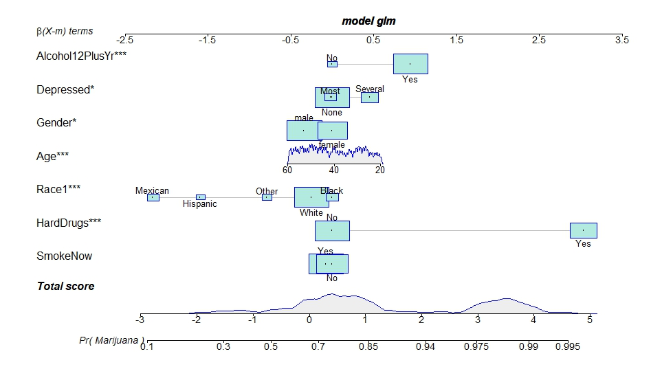

```{r echo = FALSE}
library("vembedr")
```

<center>

How marijuana works, by National Geographic.

```{r echo = FALSE}
embed_url("https://www.youtube.com/watch?v=Kg8wrzmIdyI")
```

</center>

This session, we will focus on modelling of *binary outcomes* in
epidemiology. These are very common, as many times we will be dealing
with diseases which we either do or do not have.

We will learn how to:

-   Plot relationships with binary variables
-   Run and interpret regression models
-   Calculate attributable risk
-   Use regression nomograms to better understand regression models
-   Interpret the model fit

## Introduction to logistic regression

We have, by now, covered linear regression which is used when an outcome
variable is continuous. For count outcomes, we use Poisson regression
and its derivatives, where the outcome variable is a count or integer.
For outcomes that are binary ("yes" or "no" for example), logistic
regression is the answer.

### Mathematical theory

Logistic models rely on a mathematical trick to transform the right hand
side of a regression equation
$\beta_0 + \beta_1 x_1 + \beta_2 x_2 + ... + \beta_z x_z$, with $z$
exposures or confounders (covariates) from a real number (positive or
negative) to a probability (constrained to be between zero and one).
This is accomplished by the magical **logit** transformation of the
outcome. The **logit** transformation or **log(odds)** is:

$\text{logit}(p) = ln\left( \frac{p}{1-p} \right)$

Where: $p$ is a binary variable where `1` indicates the presence and `0`
the absence of disease.

The logistic model is therefore:

$\text{logit}(p) = \beta_0 + \beta_1 x_1 + \beta_2 x_2 + ... + \beta_z x_z + \epsilon$

Notice, we've added the $\epsilon$ or error term here to describe the
distance between observed and model predicted data (residual).

### Interpreting $\beta$ coefficients

The main thing to remember with logistic models is that the $\beta$
coefficients need to be exponentiated to be easily interpretable in
epidemiological terms. They are interpreted as **odds ratios** which
describe the increased or decreased odds of the outcome $p$ for a one
unit change in the exposure or covariate $x$. This has parallels with
linear and count regressions.

Remember that odds are simply a transformation of risk:

$\text{odds} = \frac{p}{1 - p}$

Note also, that on a **logit** scale, the logistic regression function
is linear. This is nicely illustrated in the following [shiny
app](https://supsych.shinyapps.io/logistic_regression/){target="_blank"},
by ticking the **Plot in logit domain** check box.

## Getting started

We will be leaning on the following libraries to do these analyses:

-   [`regplot`](https://cran.r-project.org/web/packages/regplot/index.html){target="_blank"}
-   [`PerformanceAnalytics`](https://cran.r-project.org/web/packages/PerformanceAnalytics/index.html){target="_blank"}
-   [`jtools`](https://jtools.jacob-long.com/){target="_blank"}
-   [`corrplot`](https://r-coder.com/correlation-plot-r/){target="_blank"}
-   [`finalfit`](https://finalfit.org/){target="_blank"}
-   [`car`](https://socialsciences.mcmaster.ca/jfox/Books/Companion/index.html){target="_blank"}
-   [`AF`](https://cran.r-project.org/web/packages/AF/AF.pdf){target="_blank"}
-   [`arsenal`](https://mayoverse.github.io/arsenal/articles/tableby.html){target="_blank"}

## **Background**

<center>{width="400"}</center>

Imagine that we have been assigned a task to consider risk factors for
marijuana use, and we have in mind some programmes to help reduce
harmful use of the drug, but we need to know where to target this
resource. How can we do that?

Well, we have a survey of marijuana use in a representative population,
so we will analyse the data to see what the major risk behaviours are.

This is available in the
[NHANES](https://cran.r-project.org/web/packages/NHANES/NHANES.pdf){target="_blank"}
US national health survey.

What sort of factors do you think are likely to increase the risk of
taking recreational marijuana?

[If you were selecting potential risk factors, which of all the
variables in the NHANES dataset would you consider testing for and
why?]{style="color:blue"}

## **Summary of analysis**


1.  **Load libraries** and **import data** (here the data is imported
    from an installed library).

2.  **Check data integrity** (we will skip through this)

3.  **Subset data**. It doesn't make sense to ask very young children
    about their marijuana use! In an epidemiological study, the
    denominator should consist of people at risk of the event of
    interest!

4.  **Plot associations** between various demographic and behavioural
    risk factors and marijuana use. Conduct crude analyses, using odds
    ratios. We'll be using histograms, boxplots (`lattice` package) and
    Euler plots (`eulerr` package). Check the bivariable associations
    and correlations between variables
    `PerformanceAnalytics::chart.Correlation()`). For this, we will need
    to convert character or factor variables (`"Yes"` or `"No"`, or
    `TRUE` or `FALSE`) to numeric variables (`1` or `0`).

5.  If writing a paper, you would normally make a '**Table 1**' in which
    the various risk factors are divided by the outcome with column
    percentages and appropriate statistical tests. We will skip through
    this, but include it for completeness. This gives us similar
    information as in the previous point, but limited only to
    associations between exposures, confounders and outcome, rather than
    also between exposures and confounders as well. We will use the
    `arsenal::tableby()` function.

6.  **Logistic regression**, use `finalfit` and `regplot`to finalise and
    visualise models. `jtools` is useful for making initial model output
    interpretable!

7.  We've added a step here, which is to estimate the **population
    attributable risk**, using the `AF::AFglm()` function. This gives an
    idea of how important each exposure is, in terms of contributing to
    the outcome. This calculation assumes that the exposure *causes* the
    outcome (marijuana) here, rather than just being associated with it.
    This function is less permissive than others, and expects us to do
    the hard work of transforming categorical variables into a
    mathematical form, like for the fourth point.

8.  **Check model fit** (`car::marginalModelPlots()`) and adjust the
    model if necessary.

9.  **Interpret the study results**. Which variables are significantly
    associated Could there be other explanations other than a causal
    explanation? Could it be: reverse causation, measurement error,
    social desirability bias?

Please have a go at the homework. You will only start to understand `R`
if you have a go at it.

### Further reading

Weist et al. [Journal of Paediatrics and Child Health 51 (2015)
670--673](https://onlinelibrary-wiley-com.ezproxy.auckland.ac.nz/doi/pdf/10.1111/jpc.12895){target="_blank"}.

```{r setup, include=FALSE}

# if(!require(rio)) install.packages("rio")
# if(!require(rmarkdown)) install.packages("rmarkdown")
# if(!require(learnr)) install.packages("learnr")
# if(!require(tufte)) install.packages("tufte")
# if(!require(visdat)) install.packages("visdat")
# if(!require(DiagrammeR)) install.packages("DiagrammeR")
# if(!require(r2symbols)) install.packages("r2symbols")
# if(!require(skimr)) install.packages("skimr")
# if(!require(prettydoc)) install.packages("prettydoc")
# if(!require(gradethis)) install.packages("gradethis")
# if(!require(remotes)) install.packages("remotes")
# remotes::install_github("rstudio/gradethis")

# if(!require(NHANES)) install.packages("NHANES")
# if(!require(AF)) install.packages("AF")
# if(!require(arsenal)) install.packages("arsenal")

library(learnr)
library(tufte)
library(rio)
library(visdat)
library(fs)
library(ggplot2)
library(DiagrammeR)
library(r2symbols) # cheatsheet here: https://r2symbols.obi.obianom.com/symbols/
library(learnr)
library(gradethis)
library(skimr)
library(epiDisplay)
library(lattice)
library(finalfit)
library(tidyverse)
library(NHANES)
library(knitr)
library(kableExtra)
library(readr)
library(dplyr)
library(jtools)
library(ggstance)
library(broom.mixed)
library(car)
library(eulerr)
#library(regplot)
library(AF)
library(PerformanceAnalytics)
library(arsenal)

gradethis::gradethis_setup()


# Load data
data("NHANES")

# Setup work space
options(width = 600)

# Restrict to adults
Na <- NHANES |> subset(Age >= 20) |> data.frame()

# Restrict to those with complete responses to Marijuana variable
M <- Na |> subset(!is.na(Na$Marijuana))

M$SmokeCurrent <- ifelse(M$SmokeNow == "Yes", "Yes", "No")

M$All <- 1 # Assigns `1` to all rows. We’ll use this to create an ellipse for all participants
M$Marijuana_factor <- M$Marijuana |> factor() |> relevel(ref = "Yes")
M$HardDrugs_factor <- M$HardDrugs |> factor() |> relevel(ref = "Yes")
M$Alcohol_factor <- M$Alcohol12PlusYr |> factor() |> relevel(ref = "Yes")

# Euler plot
fit1 <- eulerr::euler(M[,c("Marijuana_factor",
                           "HardDrugs_factor",
                           "Alcohol_factor"  ,"All")] |> na.omit(),
                      shape = "ellipse")

# Logistic model
model <- glm(Marijuana ~ HardDrugs, data = M,
             family = binomial(link = "logit"))

M$HardDrugs_bin <- ifelse(M$HardDrugs == "Yes", 1, 0)
M$SmokeNow_bin <- ifelse(M$SmokeNow == "Yes", 1, 0)
M$Male <- ifelse(M$Gender == "male", 1, 0)
M$Marijuana_bin <- ifelse(M$Marijuana == "Yes", 1, 0)
M$Alcohol_bin <- ifelse(M$Alcohol12PlusYr == "Yes", 1, 0)

model_bin <- glm(Marijuana_bin ~ SmokeNow_bin + HardDrugs_bin + Age + Race3+
               Male + Alcohol_bin, data = M,
             family = binomial(link = "logit"))

# regplot(model)
# car::marginalModelPlots(model, sd = TRUE)

mycounter <- 0
Qnum <- function(count = mycounter){
  mycounter <<- mycounter + 1
  paste0("Question ", mycounter)
}

# tutorial_options(
#   exercise.timelimit = 60,
#   # A simple checker function that just returns the message in the check chunk
#   exercise.checker = function(check_code, ...) {
#     list(
#       message = eval(parse(text = check_code, ...)),
#       correct = logical(0),
#       type = "info",
#       location = "append"
#     )
#   }
# )
knitr::opts_chunk$set(error = TRUE)
```

## **Loading libraries and data**

Again, we use the `pacman` library to load other libraries.

```{r library_1, eval = FALSE}
if(!require(pacman)) install.packages("pacman")


pacman::p_load(magrittr, epiDisplay, tidyverse,
               rio, NHANES, visdat, skimr, finalfit, knitr, 
               kableExtra, readr, dplyr, lattice, jtools, 
               ggstance, broom.mixed, car, eulerr, regplot, 
               AF,# Model based attributable fractions 
               PerformanceAnalytics, # correlations    
              arsenal) # Making tables

## Respond with a "Y" if asked for a personal library.
update.packages(ask = FALSE)
```

Run the next line of code to increase the width of the output in the
console.

```{r data_1, exercise = TRUE}
## Setup work space
options(width = 600)
```

Load our data, which is the NHANES dataset.

```{r data_2, exercise = TRUE}
## Load data----
data("NHANES")
```

Use `?` to find out more about this dataset.

```{r data_3, exercise = TRUE}
?NHANES
```

It doesn't really make sense to ask children about marijuana use. So
we'll focus on those aged 20 or over. Run this line of code, which
creates a new dataset called `Na` that includes only those aged ≥20
years.

```{r data_4, exercise = TRUE}
## Restrict to adults
Na <- NHANES |> subset(Age >= 20) |> data.frame()
```

## **Univariable distributions and associations**

In this section, we'll look at the distribution of age and behaviour
group, and see what groups are associated with marijuana use.\
Use the `tab1` function to view the groups sizes for our outcome,
`Marijuana`.

```{r univariable_1, exercise = TRUE}
Na$Marijuana |> tab1()
```

[Notice that there are a lot of missing responses
(`NAs`)?]{style="color:blue"}\
Remove these with the next line of code which creates a new dataset
called `M`:\
- `is.na` selects `NA` (missing) values and `!` means "not"\
- So `!is.na` findings selects `non-missing` values

Restrict to those with complete responses to `Marijuana` variable

```{r univaiable_2, exercise = TRUE}
M <- Na |> subset(!is.na(Na$Marijuana))
```

Use the `skim()` function to get a summary of our dataset

```{r univariable_3, exercise = TRUE}
M |> skim()
```

[Are there any implausible values (check `p0` and
`p100`)?]{style="color:blue"}

#### Outcome: **marijuana use**

We just removed missing responses for `Marijuana.` Check if they've been
removed.

```{r univariable_4, exercise = TRUE}
M$Marijuana |> tab1()
```

[Please check that the missing responses been
removed.]{style="color:blue"}

#### Do depressed people self-medicate with marijuana?

Inspect the groups for the `Depressed` variable.

```{r univariable_5, exercise = TRUE}
M$Depressed |> tab1()
```

You should get 3 depression groups: none, several and most.\
- [What are their units?]{style="color:blue"}\
- Use `?NHANES` to find out

Use the `str` function to find out what type of variable our outcome is.
For our analyses, it should be of the type, `factor`. Check if it is.

```{r univariable_6, exercise = TRUE}
M$Marijuana |> str()
```

[What type of variable is it?]{style="color:blue"}

The `cc()` function (from the `epiDisplay` package) calculates and
displays odds ratios.\
Use this to look at the relationship between `Depressed` (exposure) and
`Marijuana` (outcome).

```{r univariable_7, exercise = TRUE}
cc(M$Marijuana, M$Depressed) # Outcome first, exposure second
```

Look at the computer output.

The P-values that we've previously dealt with in this course compare 2
groups. This *P*-value is different because we have 2 groups for
marijuana and 3 groups for depression -- but just 1 *P*-value. So the
*P*-value is *not* for comparing 2 groups. Instead, what it's testing
has a special name called the **main** effect or **overall** effect:
this is for the *overall association* between the 2 variables. As it's
almost zero, it means that, *overall*, depression is associated with
marijuana use.

Look at the graph.\
[What do you think is the reference group for `Depressed`?
Why?]{style="color:blue"}\
[The vertical bars represent 95% confidence intervals. Do they exclude
1?]{style="color:blue"}

##### **`r Qnum()`**

```{r univariable_8, echo = FALSE}
question("Look at the computer output and graph. Which of the following statements are true?",
answer("The odds of marijuana use is 1.22 higher in those in the `Most` group than in those in the `None` group", message = "No. As the word *ratio* is in the output, what should we add after `1.22` to imply a ratio?"),
  answer("The odds of marijuana use is 1.22 higher in those in the `Most` group than in those in *all other* groups", message = "No. As the word *ratio* is in the output, what should we add after `1.22` to imply a ratio? Also, the reference group, which should have an OR of `1` next to it in the output, is NOT *all other* groups. What group has an OR of `1` next to it?"),
  answer("The odds of marijuana use is 1.22 *times* higher in those in the `Most` group than in those in the `None` group", message = "Yes, the word *times* suggests a ratio. The `None` group is the reference group as it has an OR of `1`",  correct = TRUE),
  answer("The odds of being in the `Most` group is 1.22 *times* higher those who used marijuana", message = "No, the statement implies that the outcome is the `Most` group but this is not the case"),
  allow_retry = TRUE
)
```

#### Do men or women tend to take marijuana?

##### **`r Qnum()`**

Use the `cc` function to show the relationship between gender (exposure)
and marijuana use (outcome).

```{r univariable_9, exercise = TRUE}
# cc(dataset$outcome, dataset$exposure)
```

```{r univariable_9-solution}
cc(M$Marijuana, M$Gender)
```

::: {#univariable_9-hint}
**Hint:** What are `dataset`, `outcome` and `exposure` for this
question? Use the `names` function to list the variable names
:::

```{r univariable_9-check}
grade_this_code("Good! Note that, for the `cc` function, we list the outcome first and exposure second ")
```

The graph shows that `female` is the reference group as the red arrow
points *away* from it.\
How do you interpret the OR in the graph?

#### Is age associated with marijuana?

As age is a *continuous* variable, we'll use a box and whisker plot to
visualise its association with our outcome. For this, we'll use the
`lattice::bwplot` function, which we've used in a previous tutorial.

```{r univariable_10, exercise = TRUE}
lattice::bwplot(Age ~ Marijuana, data = M)
```

[Is age associated with marijuana?]{style="color:blue"}

#### Is BMI associated with marijuana?

##### **`r Qnum()`**

Create a plot with `lattice::bwplot()` to
show the relationship between `BMI` (exposure) and `Marijuana` use
(outcome).

```{r univariable_11, exercise = TRUE}
# lattice::bwplot(variable1 ~ variable2, data = dataset)
```

```{r univariable_11-solution}
lattice::bwplot(BMI ~ Marijuana, data = M)
```

::: {#univariable_11-hint}
**Hint:** What are `variable1`, `variable2` and `dataset` for this
question? Use `?lattice::bwplot` if needed
:::

```{r univariable_11-check}
grade_this_code("Good job! Note that, for the `lattice::bwplot` function, we list the continuous variable (`BMI`) first and categorical variable (`Marijuana`) second")
```

[Is `BMI` associated with marijuana use? What is the median BMI for each
group?]{style="color:blue"}

#### Are smokers more likely to take marijuana?

The question for `SmokeNow` is only asked if a person smokes and it
tells us whether a smoker is an ex-smoker or a current-smoker. As
missing values indicate that the person doesn't smoke, we need to
replace these with a group called `Never` which indicates that the
person is a non-smoker (never smoked). To do this, run this code.

```{r univariable_12, exercise = TRUE}
M$SmokeCurrent <- ifelse(M$SmokeNow == "Yes", "Yes", "No")

## Visualise result
M$SmokeCurrent |> tab1()
```

Now use the `cc()` function to test whether `SmokeCurrent` is associated with
`Marijuana`.

```{r univariable_13, exercise = TRUE}
cc(M$Marijuana, M$SmokeCurrent)
```

[What is the reference group? How can we tell from our
results?]{style="color:blue"}

##### **`r Qnum()`**

```{r univariable_14, echo = FALSE}
question("Your output should read `P value = 0`. What’s the most appropriate P-value to report?",
answer("P = 0", message = "No. A P-value is *never exactly 0.* There is always a chance (no matter how small), that our observed results (or one more extreme) could have occurred under the null hypothesis"),
  answer("P = 0.0001", message = "No, you should get a very high Chi-squared statistic (of 137), which suggests a P-value lower than this"),
  answer("P < 0.0001", message = "Yes, this is consistent with the very high Chi-squared statistic (of 137). It is common to report very low P-values this way",  correct = TRUE),
  allow_retry = TRUE
)
```

#### What about alcohol?

There are 2 alcohol variables and the first one we'll look at is
`AlcoholYear`: the number of days over the past year that the
participant drank alcohol. This is a continuous variable - so use a box
plot to visualise its relationship with the categorical outcome `Marijuana` use.

```{r univariable_15, exercise = TRUE}
lattice::bwplot(AlcoholYear ~ Marijuana, data = M,
                ylab = "Average number of days in year alcohol consumed")
```

[How would you describe the relationship between `AlcoholYear` and
`Marijuana`?]{style="color:blue"}

The second alcohol variable we'll consider is `AlcoholDay`: the average
number of drinks consumed on days that a participant drank alcohol. This
is also continuous variable - so use a box plot.

```{r univariable_16, exercise = TRUE}
lattice::bwplot(AlcoholDay ~ Marijuana, data = M,
                ylab = "Average number of drinks of alcohol consumed")
```

[Is the *strength* of the association between `AlcoholDay` and
`Marijuana` weak, medium or strong?]{style="color:blue"}

#### Is marijuana a rich or poor issue?

The next risk factor is household income (`HHIncomeMid`). Another
continuous variable - so use a box plot.

```{r univariable_17, exercise = TRUE}
lattice::bwplot(HHIncomeMid ~ Marijuana, data = M,
                ylab = "Household income (US$ per year)")
```

[Does medium income differ much across marijuana
groups?]{style="color:blue"}

#### Hard drugs?

`HardDrugs` is a categorical variable which indicates whether a
participant has ever tried cocaine, crack cocaine, heroin or
methamphetamine. Use the `cc()` function to test whether this behaviour
is associated with `Marijuana`.

```{r univariable_18, exercise = TRUE}
cc(M$Marijuana, M$HardDrugs)
```

[How would you describe the relationship between `HardDrugs` and
`Marijuana`?]{style="color:blue"}

## **Euler plots**

Euler plots are Venn diagrams that allow us to visualise associations
between categorical variables, such as exposures and outcomes. These
show the overlap between groups, which are represented as circles or
ellipses.

When interpreting a Euler plot please note that:\
- The **area** of the ellipse is proportional to the counts of
individuals with that characteristic.\
- More **overlap** between variables indicates
*stronger* statistical association between them.

Create a Euler plot to visualise associations between `Marijuana`,
`HardDrugs` and `Alcohol12PlusYr`.

```{r euler_1, exercise = TRUE}
M$All <- 1 # Assigns `1` to all rows. We’ll use this to create an ellipse for all participants

# Euler chooses the reference category as that to plot.
# We want to show the "Yes" category, so we'll change the reference
# from "No" to "Yes"

M$Marijuana_factor <- M$Marijuana |> factor() |> relevel(ref = "Yes")
M$HardDrugs_factor <- M$HardDrugs |> factor() |> relevel(ref = "Yes")
M$Alcohol_factor <- M$Alcohol12PlusYr |> factor() |> relevel(ref = "Yes")

# Euler plot
fit1 <- eulerr::euler(M[, c("Marijuana_factor",
                           "HardDrugs_factor",
                           "Alcohol_factor"  ,
                           "All")] |> na.omit(),# subset data and remove missing
                            shape = "ellipse")

plot(fit1, 
     main = "Marijuana, Alcohol and Hard drugs")
```

Note:\
- 3 variables in the plot end in `_Yes.` This is because the
`relevel(ref = "Yes")` in our code above makes `_Yes` the reference
group and the group that a Euler plot shows is the *reference* group\
- The area of the `Alcohol_factor_Yes` (dark pink) group is similar to
the area of the `All` (white) group. This indicates that a *high %* of
the sample were in the `Alcohol_factor=Yes` group.

[Do the ellipses for `Alcohol_factor_Yes`, `Marijuana_factor_Yes` and
`HardDrugs_factor_Yes` overlap?]{style="color:blue"}\
[What does this tell us about the strength of their
associations?]{style="color:blue"}

```{r euler_2, exercise = TRUE}
M$Marijuana |> tab1()
M$HardDrugs |> tab1()
M$Alcohol12PlusYr |> tab1()
```

Let's add a legend to make it easier to see what the colours represent.
Also, to help quantify the degree of overlap between the groups, we'll
add count and % values.

```{r euler_3, exercise = TRUE}
plot(fit1, 
     legend = list(labels = c( "All", "Marijuana","HardDrugs", "Alcohol")),
     quantities = list(type = c("percent", "counts")))
```

Let's now focus on the association between `Alcohol_factor` and
`Marijuana_factor` by dropping `HardDrugs_factor` from our plot.

```{r euler_4, exercise = TRUE}
fit1 <- eulerr::euler(M[,c("Marijuana_factor",
                           "Alcohol_factor",
                           "All")] |>  na.omit(),
                          shape = "ellipse")

plot(fit1, main = "Marijuana and Alcohol")
```

##### **`r Qnum()`**

```{r euler_5, echo = FALSE}
question("Look at the Euler plot. Which of the following statements are true? (select all that apply)",
answer("The area between the blue and grey areas represents those in the `Marijuana=Yes` group *and* those in the `Alcohol_factor_Yes` group", message = "Statement 1 is true as, in that area, both ellipses overlap. ",  correct = TRUE),
  answer("A high % of those in the `Marijuana=Yes` group (outcome) are also in the `Alcohol_factor_Yes` group", message = "Statements 2 and 3 are true as a high % of the area represented by the `Marijuana=Yes` group *overlaps* with the `Alcohol_factor=Yes` ellipse",  correct = TRUE),
  answer("`Alcohol_factor` is strongly associated with `Marijuana_factor`", message = "",  correct = TRUE),
  allow_retry = TRUE
)
```

## **Publication-quality by-group frequency tables (Table 1)**

We can use the `tableby()` function in the `arsenal` library to produce a
publication-quality table of count and % values for variables by
Marijuana use. Usually, this is `Table 1` in a publication.

```{r pub_table1_1, exercise = TRUE}
tab1 <- arsenal::tableby(Marijuana ~ # column
                            SmokeNow + # rows
                            HardDrugs + 
                            Race1 + 
                            Age + 
                            Gender + 
                            Depressed + 
                            Alcohol12PlusYr, 
                            data = M)

summary(tab1, text = TRUE)
```

In **posit**, this table can be copied to a clipboard (accessible from
the `File` tab) and pasted into a document using the code below. (Below,
we've named the file `trash`). This means you don't have to create a
table manually by typing in values -- so it saves you time!\
`write2html(tab1, "./trash.html", title = "My table in html")`\
`write2word(tab1, "./trash.doc", title = "My table in Word")`

[From the table above, Which variables are associated with
`Marijuana`?]{style="color:blue"}

## **Logistic model**

We'll build models using logistic regression. Before we start, our
categorical variables should be of the type, `factor` rather than
`character` - check if they are using the `str()` function.

```{r logistic_1, exercise = TRUE}
M$HardDrugs |> str()
M$SmokeNow |> str()
M$Race1 |> str()
```

Run this code to look at the association between `HardDrugs` and
`Marijuana`.\
- `glm()` stands for *generalised linear model*\
- `family = binomial(link = "logit")` indicates that we're using
logistic regression (logit link and binomial errors).

The basic logistic model is produced with the following code:

```{r logistic_2, exercise = TRUE}
model <- glm(Marijuana ~ HardDrugs, data = M,
             family = binomial(link = "logit"))
summary(model)

```

##### **`r Qnum()`**

```{r logistic_3, echo = FALSE}
question("For `HardDrugs`, you should get an `Estimate` value of 3.31305. What does this tell us?",
answer("The odds of marijuana use is 3.31305 higher among hard drug users", message = "No. *3.31305* is measured on a natural-log scale. So you need to exponentiate it to give a meaningful interpretation"),
  answer("The odds of marijuana use is 3.31305 *times* higher among hard drug users", message = "No. *3.31305* is measured on a natural-log scale. So you need to exponentiate it to give a meaningful interpretation"),
  answer("The odds of marijuana use is exp(3.31305) higher among hard drug users", message = "No. Exponentiating this converts it into an odds ratio. However, *exp(3.31305) higher* does not imply a ratio. What word do we need to add to imply a ratio?"),
  answer("The odds of marijuana use is exp(3.31305) *times* higher among hard drug users", message = "Yes, exponentiating 3.31305 converts it into an odds ratio. The word *times* suggests a ratio",  correct = TRUE),
  allow_retry = TRUE
)
```

Exponentiate the model $\beta$ coefficients with the `jtools::summ()` function to derive odds ratios.

```{r logistic_4, exercise = TRUE}
jtools::summ(model, exp = TRUE)
```

##### **`r Qnum()`**

```{r logistic_5, echo = FALSE}
question("For `HardDrugsYes`, you should get an `exp(Est.)` value of 27.47. What does this tell us?",
answer("The odds of marijuana use is 27.47 higher among hard drug users", message = "No. 27.47 is a ratio. What word do we need to add to imply a ratio?"),
  answer("The odds of marijuana use is 27.47 *times* higher among hard drug users", message = "Well done! *27.47 times* implies a ratio and 27.47 is the odds ratio",  correct = TRUE),
  answer("The odds of marijuana use is exp(27.47) higher among hard drug users", message = "No. 27.47 is already an exponentiated value (R code above reads `exp = TRUE`) – you don’t need to exponentiate again!"),
  answer("The odds of marijuana use is exp(27.47) *times* higher among hard drug users", message = "No. 27.47 is already an exponentiated value (R code above reads `exp = TRUE`) – you don’t need to exponentiate again!"),
  allow_retry = TRUE
)
```

[How would you describe the **strength** of association between hard
drugs and marijuana use?]{style="color:blue"}

That was a *univariable* model with just one exposure (`HardDrugs`). Now
we'll create a *multivariable* model so that we can also adjust for
potential confounders.

```{r logistic_6, exercise = TRUE}
model <- glm(Marijuana ~ SmokeNow + HardDrugs + Race1 + Age + 
               Gender + Depressed + Alcohol12PlusYr, data = M,
             family = binomial(link = "logit"))

jtools::summ(model, exp = TRUE) # Exponentiate the beta coefficients to get odds ratios
```

[Which variables are significantly associated with marijuana
use?]{style="color:blue"}

## **Attributable risk**

Attributable risk quantifies the proportion of an outcome that is
attributable to a particular exposure.

To calculate this in **R**, we need to first:\
- identify the group names for our variables\
- assign these names values of `0` and `1` so that we create binary
variables.

First up is `HardDrugs`. Identify the group names and them assign these
values of 0 and 1.

```{r af_1, exercise = TRUE}
M$HardDrugs |> tab1() # Identify group names
M$HardDrugs_bin <- ifelse(M$HardDrugs == "Yes", 1, 0) # Change `"Yes"` to `1` and everything else to `0.`
```

Do the same for `SmokeNow.`

```{r af_2, exercise = TRUE}
## Change variable from factor to character to allow next line of 
## code to run

M$SmokeNow <-  M$SmokeNow |> as.character()

## Change missing (never smokers) to "never"
M[is.na(M$SmokeNow), "SmokeNow"] <- "Never"

M$SmokeNow |> tab1()

## Make a numeric binary variable from "Smokenow"
M$SmokeNow_bin <- ifelse(M$SmokeNow == "Yes", 1, 0)


```

Do the same for `Gender.`

```{r af_3, exercise = TRUE}
M$Gender |> tab1()
M$Male <- ifelse(M$Gender == "male", 1, 0)
```

And the same for `Marijuana.`

```{r af_4, exercise = TRUE}
M$Marijuana |> tab1()
M$Marijuana_bin <- ifelse(M$Marijuana == "Yes", 1, 0)
```

And for `Alcohol12PlusYr.`

```{r af_5, exercise = TRUE}
M$Alcohol12PlusYr |> tab1()
M$Alcohol_bin <- ifelse(M$Alcohol12PlusYr == "Yes", 1, 0)
```

Put the binary variables we created into a multivariable model so we can
calculate attributable risk.

```{r af_6, exercise = TRUE}
model_bin <- glm(Marijuana_bin ~ SmokeNow_bin + 
                    HardDrugs_bin + 
                    Age + 
                    Race1 +
                    Male + 
                    Alcohol_bin, 
                    data = M,
                    family = binomial(link = "logit"))
```

Calculate attributable fraction from cigarette smoking.

```{r af_7, exercise = TRUE}
AF::AFglm(model_bin, data = M, 
          exposure = "SmokeNow_bin", 
          case.control = FALSE)
```

Please interpret the output.

##### **`r Qnum()`**

```{r af_10, echo = FALSE}
question("AF quantifies the impact of smoking on marijuana use, but makes the hidden assumption that smoking *causes* or leads to marijuana use",
answer("True", message = "Yes, AF assumes that the exposure (smoking) causes the outcome (marijuana use)",  correct = TRUE),
  answer("False", message = "No, AF assumes that the exposure (smoking) causes the outcome (marijuana use)"),
  allow_retry = TRUE
)
```

##### **`r Qnum()`**

```{r af_11, echo = FALSE}
question("If smoking was more prevalent in the population, the calculated AF would be the same.",
answer("True", message = "No, if prevalence of smoking increased, then AF would also increase."),
  answer("False", message = "Yes, AF would also increase if the prevalence of smoking increased.",  correct = TRUE),
  allow_retry = TRUE
)
```

Calculate the attributable fraction of the influence of `HardDrugs_bin`
use on `Marijuana`.

```{r af_12, exercise = TRUE}
AF::AFglm(model_bin, data = M, 
          exposure = "HardDrugs_bin", 
          case.control = FALSE)
```

Calculate the attributable fraction from alcohol use (`Alcohol_bin`) on
`Marijuana` use.

```{r af_13, exercise = TRUE}
AF::AFglm(model_bin, data = M, 
          exposure = "Alcohol_bin", 
          case.control = FALSE)
```

Previously, we saw that the odds ratio is much higher for hard drugs
than for alcohol. However, the attributable fraction is highest for
alcohol.

[Why is this?]{style="color:blue"}

## **Correlations**

In the previous section, we created binary variables. This allows us to
look at correlations between them and other variables.

```{r correl_1, exercise = TRUE}
# Select variables for corelation analysis
my_data <- M[, c("Male",
                  "Marijuana_bin", "Alcohol_bin", "SmokeNow_bin",
                  "HardDrugs_bin", "Age")]

PerformanceAnalytics::chart.Correlation(my_data, 
                                        histogram=TRUE, pch=19)
```

[Which variable is most strongly correlated with the outcome
(`Marijuana_bin`)?]{style="color:blue"}

## **Regression nomogram**

This is a visual summary of the contributions of predictors to an
outcome. We covered regression nomograms in the previous tutorial.

The following code draws a regression nomogram for our model from
the **logistic model** section.

`regplot(model)`

The output is shown below



The nomogram depicts the structure of the model as a weighted average.

Each variable contributes a score `β(X-m) terms` based on the horizontal deviation.
These are summed for each individual to give a `Total score`.\
Reading vertically down from the `Total score`, then gives a probability of `Marijuana` use for each individual in the model (ranging between 0 and 1).

The horizontal distance between boxes or degree of spread of density plots for variables represents the relative influence of the variable on the model outcome.

The size of each box shows the distribution of categorical variables and the density plot shows the distribution of continuous variables.

##### **`r Qnum()`**

```{r nomogram_2, echo = FALSE}
question("Look at the nomogram. Which of the following statements are true (select all that apply)?",
answer("`HardDrugs_bin` contributes more to the outcome (marijuana use) than `SmokeNow_bin`", message = "Statement 1 is true as `HardDrugs_bin` has a much longer scale",  correct = TRUE),
  answer("There are similar numbers of males and females", message = "Statement 2 is true also: for the `Male` density plot or histogram, the heights at 0 (females) and 1 (males) are similar, indicating similar numbers",  correct = TRUE),
  allow_retry = TRUE
)
```

## **Model fit**

How well a model fits the data can be assessed with a marginal model
plot, which shows the relationship between model predicted and observed
data.


```{r mmp, exercise = TRUE, warning = FALSE, error=FALSE}
assign("M", M, envir = .GlobalEnv)
assign("model_bin", model, envir = .GlobalEnv)

## marginal model plot
car::marginalModelPlots(model_bin)
```


We covered marginal model plots in the previous tutorials.\
Look at the plots above. [How well does the overall model fit the
data?]{style="color:blue"}

## **Publication-quality regression tables (Table 2)**

The code below allows us to produce publication-quality regression
tables. Usually, a regression table is `Table 2` in a publication. Note that the `dependent` variable must be a `factor` variable with two levels for this code to produce a *logistic regression* model, rather than a linear or other regression.

```{r pub_table2_1, exercise = TRUE}
dependent <- "Marijuana"
explanatory <- c(
  "SmokeNow", 
  "HardDrugs","Race1", "Age", "Depressed", "Alcohol12PlusYr")

M |>
 finalfit(dependent, explanatory) -> regression_table
  
  
regress_tab <- knitr::kable(regression_table, row.names = FALSE, 
                            align = c("l", "l", "r", "r", "r"))

regress_tab |> kableExtra::kable_styling()
```

[Which demographic group has the highest odds for marijuana
use?]{style="color:blue"}

## **Summary**

Today, we have extended regression to account for binary variables which are 
often used in epidemiology. Logistic regression is used to predict the probability of a binary outcome such as disease.

- It is often used when the outcome is a binary variable and there are confounders to adjust for.
- The principles are similar to usual regression, however the beta coefficients are exponentiated and interpreted as odds ratios.
- The outcome variable must have only two levels (`1` and `0`, `Yes` or `No`, or `TRUE` or `FALSE`).
- We often present results in a table with both crude and adjusted odds ratios to see the effect of adjusting for confounders on an association.

## **Homework**

Repeat the above analyses looking at risk factors for alcohol use. For
the outcome, use the response to the question: consumption of at least
12 drinks of any type of alcoholic beverage in any one year
(`Alcohol12PlusYr == "Yes"`).

Please complete this in **posit**.
